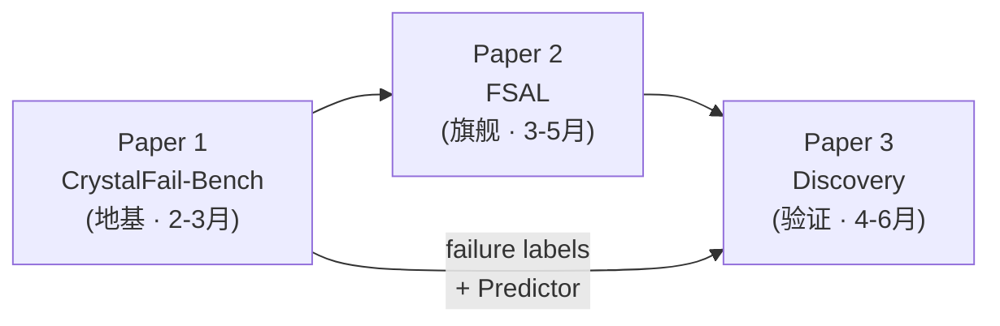
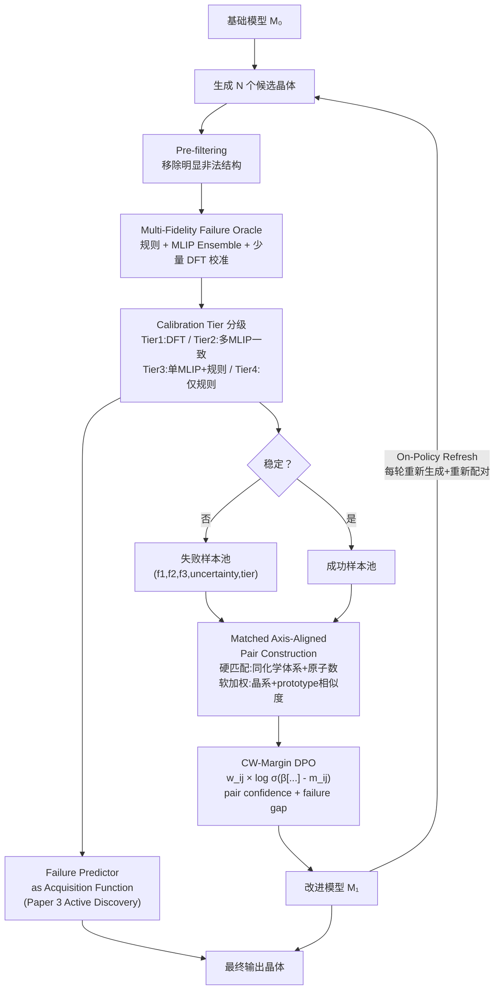

## GitHub/Codex 导出信息

- Repository name: `fiir-crystal`
- Repository role: FIIR 项目总指导文档
- Export path: `docs/guidance/01_fiir_project_manual.md`
- Document type: project-level guidance
- Codex priority: highest
- Related code package: `fiir_crystal`
- Related modules:
  - `fiir_crystal.failure`
  - `fiir_crystal.predictor`
  - `fiir_crystal.fsal`
  - `fiir_crystal.generation`
  - `fiir_crystal.evaluation`
  - `fiir_crystal.discovery`

---

## 项目实施指导手册

<aside>
📌

本手册是 **FIIR（Failure-Informed Iterative Refinement）** 项目的完整实施指导。按照本手册的步骤，你可以从零开始搭建环境、实现核心算法、运行实验并撰写论文。每个关键步骤均附带具体代码指引和参考文献。

</aside>

<aside>
🔴

**2026.05 FIIR-v2 架构升级**：经全面竞品调研与方法论深度审视，本手册已从 FIIR-v1 全面升级为 **FIIR-v2**。核心判断：底层 idea 扎实，但关键环节偏"启发式"——失败标签不够校准、pair 构造不够严格、DPO 没有利用失败幅度和置信度。以下为关键修订：
**① 多保真 Failure Oracle + Calibration Tiers**：failure vector 从 (f1,f2,f3) 升级为 (f1,f2,f3,uncertainty,calibration_tier)，用 DFT 校准集估计系统偏差
**② Matched Axis-Aligned Pairing**：pair 构造从"分数对齐"升级为"化学/结构匹配后的因果配对"，控制混杂变量
**③ Confidence-Weighted Margin DPO**：从普通 DPO 升级为 CW-Margin DPO（借鉴 MADPO/γ-PO/CW-PO），pair 越可靠权重越高、margin 由失败差值决定
**④ PLaID++（ICML 2026）[25]** 是最直接竞争对手——核心差异化须通过 axis-aligned vs weighted-sum 消融 + **多基座验证（base-model agnostic）** 证明
**⑤ On-Policy Pair Refresh**：每轮迭代重新生成 + 重新构造 matched pair + 重新计算 failure vector，防止 distribution shift
**⑥ Pre-filtering**：明显非法结构（原子重叠、晶格角异常等）在 pair 构造前直接过滤，不浪费 DPO 容量学低级错误
**⑦ Paper 3 升级为 Active Discovery Loop**：Failure Predictor 从 reranking 工具升级为 critic + acquisition function，Pareto ranking 替代硬阈值
**⑧ LeMat-GenBench** 已成为 2026 年标准评测框架——所有实验须在此 leaderboard 上报告
**⑨ Soft Preference Learning [31]** 多样性保持 + MapReduce LoRA [29] 作为实验变体（非主方法）

</aside>

---

## GitHub 项目落地结构

本项目在 GitHub 中使用仓库名 `fiir-crystal`。推荐目录结构如下：

```
fiir-crystal/
  README.md
  AGENTS.md

  docs/
    guidance/
      00_reading_order.md
      01_fiir_project_manual.md
      02_paper1_crystalfail_bench.md
      03_paper2_fsal.md
      04_paper3_discovery_pipeline.md

    specs/
      failure_taxonomy.md
      fsal_algorithm.md
      discovery_pipeline.md
      evaluation_metrics.md

    decisions/
      ADR-0001-project-scope.md
      ADR-0002-failure-label-design.md
      ADR-0003-axis-aligned-dpo.md

  fiir_crystal/
    failure/
    predictor/
    fsal/
    generation/
    evaluation/
    discovery/

  configs/
  scripts/
  experiments/
  tests/
  notebooks/
```

---

## 第一部分：项目定位与核心思路

<aside>
⚡

**一句话定位**：我们要证明 **failure structure is a learnable supervision space**——把晶体生成模型的失败样本从噪声变成结构化监督信号，从而系统性地改进生成质量。

</aside>

### 核心假设（必须通过实验验证）

1. 失败可以被结构化分解为多个独立维度，且该分解是数据驱动可验证的（Paper 1：PCA/factor analysis 验证 F1/F2/F3 对齐主成分，**新增**）
2. **带置信度校准的**结构化失败反馈 > binary/scalar 反馈（Paper 2 核心消融）
3. **化学/结构匹配后的** near-miss 偏好对 > 随机负样本的偏好对（Paper 2 核心消融，**升级为 matched pairing**）
4. 训练时结构化对齐（FSAL）> 推理时引导（路线 C），证明失败信息值得纳入训练（Paper 2 消融）
5. 多样性可在偏好学习中被显式保持：Soft Preference Learning [31] 的 entropy 解耦使 stability 提升不以 diversity 坍缩为代价
6. **Confidence-Weighted Margin DPO** 优于普通 DPO：利用 failure gap + pair confidence 加权训练信号，比 uniform-weight DPO 更稳健（Paper 2 核心消融，**新增**）
7. **FSAL 是 base-model agnostic 的**：在自回归（CrystalFormer）和至少一个扩散/flow 基座（DiffCSP++/OMatG）上均有效（Paper 2，**新增**）

### 与现有工作的差异化

| 现有工作                                                             | 做法                                                                  | 我们的差异                                                                                    |
| -------------------------------------------------------------------- | --------------------------------------------------------------------- | --------------------------------------------------------------------------------------------- |
| **CrystalFormer-RL** (Cao & Wang, 2025) [1]                          | MLIP 标量 reward + PPO                                                | 用结构化失败归因 + axis-aligned 偏好，非单一标量奖励                                          |
| **MatterGen** (Zeni et al., _Nature_ 2025) [2]                       | 扩散模型 + adapter 条件化                                             | 已被确认存在训练集泄漏问题 (_Materials Horizons_, 2026) [3]；我们通过失败学习提高质量         |
| **OMatG** (Höllmer et al., ICML 2025) [4]                            | 随机插值 + flow matching                                              | 我们的方法不绑定基座架构，可在 OMatG 之上叠加                                                 |
| **正交流引导** (Guo, AI4Mat-ICLR 2026 Workshop) [5]                  | 单属性 flow guidance 组合                                             | 我们解决"如何从失败中学习"而非"如何条件化生成"                                                |
| **PLaID++** (Xu et al., ICML 2026) [25]                              | Iterative DPO on crystal LLM（联合 stability+novelty+SG 标量 reward） | 仅用 weighted-sum 标量做 DPO；我们用结构化失败归因 + axis-aligned 偏好解耦 + near-miss mining |
| **OMatG-IRL** (Höllmer & Martiniani, AI4Mat-ICLR 2026 Workshop) [26] | 推理时 policy-gradient RL on flow-based 模型                          | 仅使用 scalar energy objective；我们的结构化失败信号更丰富，且训练时改变模型内部分布          |
| **DAO** (Nature Comm. 2026) [27]                                     | Siamese foundation models（generator + energy predictor 协同预训练）  | DAO 是预训练范式；我们是 post-training alignment，可叠加在 DAO 之上                           |
| **Self-Correcting Search** (Goodfire, 2026) [28]                     | 推理时 probe-guided 纠错（在 MatterGen 上 +27%）                      | 依赖可解释性探针且仅限推理时；我们的训练时对齐更彻底                                          |
| **MapReduce LoRA** (Chen et al., CVPR 2026 Highlight) [29]           | 多偏好 LoRA experts 并行训练 + 迭代合并                               | NLP/CV 通用框架；我们适配为晶体领域 axis-aligned LoRA variant（实验 #11）                     |
| **SHAFT** (GFlowNet, Digital Discovery 2026) [30]                    | 层级 GFlowNet + 对称性感知，天然鼓励多样性                            | 我们在 DPO 框架内通过 Soft Preference Learning [31] 解决多样性问题                            |

---

## 第二部分：论文结构与执行顺序



| 论文                           | 核心任务                                  | 目标 Venue         | 前置依赖                  |
| ------------------------------ | ----------------------------------------- | ------------------ | ------------------------- |
| **Paper 1: CrystalFail-Bench** | 构建失败归因基准 + 训练 Failure Predictor | NeurIPS D&B / ICLR | 无                        |
| **Paper 2: FSAL**              | 实现 axis-aligned 结构化偏好学习          | NeurIPS / ICML     | Paper 1 的 failure labels |
| **Paper 3: Discovery**         | 端到端发现 DFT 验证的新材料               | npj Comp. Mat.     | Paper 1 + Paper 2         |

---

## 第三部分：环境搭建（首先完成）

### 3.1 硬件需求

| 资源     | 最低配置     | 推荐配置     |
| -------- | ------------ | ------------ |
| GPU      | 2× A100 40GB | 4× A100 80GB |
| CPU 内存 | 64 GB        | 128 GB       |
| 存储     | 500 GB SSD   | 1 TB NVMe    |

### 3.2 软件环境安装

```python
# 创建 conda 环境
conda create -n fiir python=3.10 -y
conda activate fiir

# 核心依赖
pip install torch==2.1.0 torchvision torchaudio --index-url https://download.pytorch.org/whl/cu121
pip install pymatgen                  # pymatgen (Ong et al., Comp. Mater. Sci. 2013) [6]
pip install ase==3.22.1               # ASE (Larsen et al., J. Phys. 2017) [7]
pip install mace-torch                # MACE-MP-0/MPA-0 (Batatia et al., NeurIPS 2022) [8]
pip install chgnet                    # CHGNet (Deng et al., Nat. Mach. Intell. 2023) [9]
pip install matgl                     # M3GNet (Chen & Ong, Nat. Comp. Sci. 2022) [10]
pip install spglib                    # spglib (Togo et al., 2024) [11]
pip install smact                     # SMACT (Davies et al., JOSS 2019) [12]
pip install hdbscan                   # 失败模式聚类
pip install scikit-learn umap-learn   # 降维与可视化
pip install torch-geometric            # GNN (SchNet/PaiNN)
pip install trl                        # DPO 训练

# 晶体生成模型（按需安装）
git clone https://github.com/deepmodeling/CrystalFormer.git
# 可选：
git clone https://github.com/FERMat-ML/OMatG.git
git clone https://github.com/jiaor17/DiffCSP.git
git clone https://github.com/txie-93/cdvae.git
```

### 3.3 数据集准备

**主训练集**：Alexandria（Alex-20, Schmidt et al. 2024）[13]

- 下载：https://alexandria.icams.rub.de/
- 与 CrystalFormer-RL 相同训练集，确保公平对比
- 包含 >500 万 DFT 计算的无机结构

**验证集**：留出 10% 已知稳定晶体

**数据库比对用**：

- ICSD（无机晶体结构数据库）
- Materials Project（https://materialsproject.org）
- GNoME（Google DeepMind 数据库）

```python
# 下载 Alexandria 数据并转换为 pymatgen 格式
from pymatgen.core import Structure
import json

# 加载 Alexandria 数据（示例）
with open("alexandria_alex20.json") as f:
    data = json.load(f)

structures = []
for entry in data:
    struct = Structure.from_dict(entry["structure"])
    structures.append({
        "structure": struct,
        "energy_above_hull": entry["e_above_hull"],
        "formation_energy": entry["formation_energy"]
    })

print(f"总计加载 {len(structures)} 个结构")
```

---

## 第四部分：核心方法概览

### FIIR-v2 整体流程



### 3 维失败分类体系 + Calibration Tiers（FIIR-v2 升级）

| 维度                 | 检测方法                                    | 输出           | 核心工具                                 | 置信度来源                           |
| -------------------- | ------------------------------------------- | -------------- | ---------------------------------------- | ------------------------------------ |
| **F1: 几何合法性**   | 原子间距异常 + 晶格参数 + spglib 对称性偏移 | 连续 (0–1)     | pymatgen [6] + spglib [11]               | 规则检测通常高置信；边界结构降低     |
| **F2: 化学合法性**   | BVS [15] + CrystalNN [16] + SMACT [12]      | 连续 (0–1)     | pymatgen + SMACT                         | 对复杂多元体系不稳定，置信度动态调整 |
| **F3: 热力学稳定性** | MLIP ensemble 弛豫 + $E_{\text{hull}}$      | 连续 (eV/atom) | MACE-MP-0 [8] + CHGNet [9] + M3GNet [10] | 3 MLIP 一致→高；分歧大→低            |

**Failure Vector 完整格式**：`(f1, f2, f3, uncertainty, calibration_tier)`

**Calibration Tier 分级**（决定 DPO 训练中的 pair weight）：

| Tier       | 来源                               | 置信度 | DPO 权重 |
| ---------- | ---------------------------------- | ------ | -------- |
| **Tier 1** | DFT-validated（校准集，~500 样本） | 最高   | 1.0      |
| **Tier 2** | 3 MLIP 一致判定                    | 高     | 0.8      |
| **Tier 3** | 单 MLIP + 规则一致                 | 中     | 0.5      |
| **Tier 4** | 仅规则 or MLIP 分歧大              | 低     | 0.2      |

F4（可合成性）仅在 Paper 3 筛选中使用，通过 CSLLM (Sun et al., _Nature Comm._ 2025) [17] 评估，不参与核心训练信号。

**Failure Taxonomy 数据驱动验证**（Paper 1 新增实验）：对大量失败样本计算 F1/F2/F3 → PCA / factor analysis → 验证前 3 主成分是否与 geometry/chemistry/stability 高度对齐（>85% 方差解释率）。若不对齐则调整维度定义。

---

## 第五部分：两条可选执行路线

### 路线 A（推荐）：Failure-Structured Alignment（FIIR-v2 主方法）

<aside>
🅰️

**稳健、可行性强，主力路线。FIIR-v2 核心升级如下：**

**1. Pre-filtering**：生成样本中明显非法结构（原子重叠 <0.5Å、晶格角 <20° 或 >160°）在 pair 构造前直接过滤，不参与 DPO 训练——等价于"不让模型浪费容量学低级错误"

**2. Matched Axis-Aligned Pairing**：pair 构造分两层——
• **硬匹配**：同一化学体系类别（如都是 ABX₃、都是二元氧化物）+ 原子数差 ≤20%
• **软加权**：晶系相似度、prototype 相似度作为 `structure_match_score` 纳入 `pair_quality = main_axis_gap × other_axis_similarity × structure_match_score × label_confidence`
低质量 pair 不参与训练

**3. Confidence-Weighted Margin DPO**（替代普通 DPO）：
$\mathcal{L} = -w_{ij} \log \sigma\left(\beta\left[\log\frac{\pi_\theta(x_w)}{\pi_{\text{ref}}(x_w)} - \log\frac{\pi_\theta(x_l)}{\pi_{\text{ref}}(x_l)}\right] - m_{ij}\right)$
• $w_{ij}$：pair confidence（由 calibration tier 决定）
• $m_{ij}$：离散化 margin（near-miss=0.1 / moderate=0.3 / catastrophic=0.5）
• 借鉴 MADPO (TMLR)、γ-PO (ACL 2025)、CW-PO (ICLR 2026) [35-37]

**4. On-Policy Pair Refresh**：每轮迭代重新生成样本 + 重新构造 matched pair + 重新计算 failure vector，防止 distribution shift

**5. Near-miss 优先采样**：60% near-miss / 30% moderate / 10% catastrophic

**6. Soft Preference Learning** [31]：解耦 entropy 与 cross-entropy，保持多样性

**7. MapReduce LoRA variant**（实验 #11，非主方法）：F1/F2/F3 各训 LoRA adapter，推理时合并，对比 batch-level mixing

</aside>

### 路线 B（高风险高回报）：Failure-Conditioned Repair

<aside>
🅱️

**创新性最高，但与路线 A 分离处理。** 学习如何把失败晶体修复为可行晶体——输入失败晶体 + failure code，输出修复结构。类比 NLP 中的 self-correction（Reflexion, SPIRAL）。

**FIIR-v2 定位调整**：
• FSAL 是主线，用于改善生成分布
• Repair 是**第二阶段 refiner**，仅处理 **near-miss candidates**（E_hull 0.05–0.15 eV/atom）
• 修复手段限制为局部弛豫（lattice strain relaxation + Wyckoff position refinement），不改变化学组成
• 不修 catastrophic failure，不作为 Paper 2 核心贡献
• Repair 输出必须经过 MLIP/DFT 验证
• 在 Paper 2 中作为消融实验（#14）而非核心方法

</aside>

### 路线 C（新增）：推理时失败引导（Inference-Time Failure Guidance）

<aside>
🔷

**最轻量替代方案，作为 baseline。** 不修改基座模型权重，推理时用 Failure Predictor 梯度引导采样。类似 OMatG-IRL [26] 与 Self-Correcting Search [28]，但使用 3 维 failure score 而非 scalar energy。关键价值：证明训练时对齐（路线 A）相比推理时引导的增量价值。

</aside>

---

## 第六部分：实验设计速查

### 实验设计（FIIR-v2 完整版，17 组）

| #      | 方法                                                        | 要证明的结论                                                    |
| ------ | ----------------------------------------------------------- | --------------------------------------------------------------- |
| 1      | Baseline M₀（原始模型）                                     | 基准线                                                          |
| 2      | Binary Feedback DPO                                         | 结构化 > 二值                                                   |
| 3      | Energy-only PPO（复现 CrystalFormer-RL [1]）                | 结构化 > 单维标量                                               |
| 4      | Rejection Sampling FT                                       | 失败信息有价值                                                  |
| 5      | Weighted-Sum DPO                                            | Axis-aligned > 加权和                                           |
| 6      | Multi-dim PPO（F1+F2+F3 多维 reward + PPO）                 | 即使多维信息相同，axis-aligned DPO > PPO                        |
| 7      | Random Neg + FSAL                                           | Near-miss 的价值                                                |
| 8      | **FSAL-v2（完整方法）**                                     | **主方法：matched pairing + CW-Margin DPO + on-policy refresh** |
| 9      | FSAL-v2 + Reranking                                         | 双通道叠加                                                      |
| 10     | PLaID++ 复现 [25]（weighted-sum iterative DPO）             | Head-to-head：axis-aligned > weighted-sum（**核心 claim**）     |
| 11     | MapReduce LoRA variant [29]（F1/F2/F3 各训 LoRA，迭代合并） | Pareto front 推进 vs batch-level mixing                         |
| 12     | 推理时 Failure-Guided Sampling（路线 C）                    | 训练时对齐 > 推理时引导                                         |
| 13     | FSAL-v2 + Soft Preference Learning [31]（entropy 解耦）     | 多样性保持 + 质量提升可兼得                                     |
| 14     | Failure-Conditioned Repair（路线 B，near-miss only）        | 修复 vs 偏好学习：两种范式对比                                  |
| **15** | **FSAL-v2 普通 DPO（无 CW-Margin）**                        | **CW-Margin DPO > 普通 DPO（新增核心消融）**                    |
| **16** | **FSAL-v2 无匹配 pairing（仅 score-aligned）**              | **Matched pairing > 纯 score-aligned（新增核心消融）**          |
| **17** | **FSAL-v2 on 第二基座（DiffCSP++ 或 OMatG）**               | **Base-model agnostic 验证（新增，vs PLaID++ 差异化）**         |

### 监控指标

- **质量**：Stable Rate / SUN Rate（↑）；各维度失败率 F1–F3（↓）
- **多样性**：Unique / Novel / 空间群覆盖 / 组成熵（→ 不坍缩）
- **LeMat-GenBench 标准评测** [18]：在 Hugging Face 公开 leaderboard 上提交，与 OMatG、PLaID++、DiffCSP++ 等直接可比；使用 MACE + UMA + Orb-v3 三个 MLIP 作为 DFT 代理
- **Stability-Diversity Pareto 分析**：绘制 stable rate vs novelty/diversity Pareto front，展示方法在多个 operating point 上的优势，而非单点比较
- **模式坍缩缓解**：混入 50% 原始训练数据；Soft Preference Learning [31] entropy 解耦；组成熵监控（连续两轮下降 >10% 则降低学习率）
- **数据泄漏防控**：生成结构须通过 `StructureMatcher`（ltol=0.2, stol=0.3, angle_tol=5）与训练集（Alexandria）去重，确保 stable rate 和 novelty 指标的可信度
- **论文图表**：Mermaid 流程图仅用于实施规划阶段，论文投稿时须替换为 TikZ 或矢量图（PDF/SVG）

---

## 第七部分：资源与时间预估

| 资源      | 估计                                      |
| --------- | ----------------------------------------- |
| GPU 训练  | 4× A100，约 2–4 周（含多轮迭代）          |
| MLIP 验证 | 50,000 次弛豫，单 GPU 约 1–2 天           |
| DFT 验证  | Top-50 结构，约 2–4 周                    |
| 人力      | 1 人全职约 3–4 个月（Paper 1+2 并行启动） |

---

## 参考文献

1. Cao & Wang, "CrystalFormer-RL: Reinforcement Fine-Tuning for Materials Design", arXiv:2504.02367, 2025. https://arxiv.org/abs/2504.02367
2. Zeni et al., "MatterGen: A generative model for inorganic materials design", Nature, 2025. https://www.nature.com/articles/s41586-025-08628-5
3. "Continued challenges in high-throughput materials predictions: MatterGen predicts compounds from the training dataset", Materials Horizons, 2026. https://pubs.rsc.org/en/content/articlehtml/2026/mh/d6mh00268d
4. Höllmer et al., "Open Materials Generation with Stochastic Interpolants", ICML 2025. https://arxiv.org/abs/2502.02582
5. Guo, "Train Separately, Compose at Sampling: Multi-Property Crystal Generation with Orthogonal Flow Guidance", AI4Mat-ICLR 2026 Workshop. https://openreview.net/forum?id=PjkeOpfo8c
6. Ong et al., "Python Materials Genomics (pymatgen)", Comp. Mater. Sci., 2013. https://pymatgen.org/
7. Larsen et al., "The Atomic Simulation Environment", J. Phys. Condens. Matter, 2017. https://wiki.fysik.dtu.dk/ase/
8. Batatia et al., "MACE: Higher Order Equivariant Message Passing Neural Networks", NeurIPS 2022; MACE-MP-0: arXiv:2401.00096. https://github.com/ACEsuit/mace
9. Deng et al., "CHGNet: Pretrained universal neural network potential", Nature Mach. Intell., 2023. https://doi.org/10.1038/s42256-023-00716-3
10. Chen & Ong, "A universal graph deep learning interatomic potential for the periodic table (M3GNet)", Nature Comp. Sci., 2022. https://doi.org/10.1038/s43588-022-00349-3
11. Togo et al., "Spglib: a software library for crystal symmetry search", 2024. https://spglib.readthedocs.io/
12. Davies et al., "SMACT: Semiconducting Materials by Analogy and Chemical Theory", JOSS, 2019. https://github.com/WMD-group/SMACT
13. Schmidt et al., "Alexandria: Improving machine-learning models through large datasets", 2024. https://alexandria.icams.rub.de/
14. Rafailov et al., "Direct Preference Optimization: Your Language Model is Secretly a Reward Model", NeurIPS 2023. https://arxiv.org/abs/2305.18290
15. Brown, "The Chemical Bond in Inorganic Chemistry: The Bond Valence Model", Oxford Univ. Press, 2002. https://www.iucr.org/resources/data/datasets/bond-valence-parameters
16. Pan et al., "Benchmarking Coordination Number Prediction Algorithms (CrystalNN)", Inorg. Chem., 2021. https://docs.materialsproject.org/methodology/materials-methodology/related-materials
17. Sun et al., "Accurate prediction of synthesizability and precursors via large language models (CSLLM)", Nature Comm., 2025. https://doi.org/10.1038/s41467-025-61778-y
18. Betala et al., "LeMat-GenBench: A Unified Evaluation Framework for Crystal Generative Models", AI4Mat-NeurIPS 2025 Workshop. https://arxiv.org/abs/2512.04562
19. Xie et al., "Crystal Diffusion Variational Autoencoder (CDVAE)", ICLR 2022. https://arxiv.org/abs/2110.06197
20. Jiao et al., "DiffCSP++: Space Group Constrained Crystal Generation", ICLR 2024. https://arxiv.org/abs/2402.03992
21. Schütt et al., "SchNet / PaiNN: Equivariant Message Passing", ICML 2021. https://github.com/atomistic-machine-learning/schnetpack
22. Baird et al., "matbench-genmetrics", JOSS 2024. https://github.com/sparks-baird/matbench-genmetrics
23. Ye et al., "Con-CDVAE + Active Learning for Crystal Inverse Design", 2025. https://arxiv.org/abs/2502.16984
24. "Generative AI for crystal structures: a review", npj Comp. Mat., 2025. https://www.nature.com/articles/s41524-025-01881-2
25. Xu et al., "PLaID++: A Preference Aligned Language Model for Targeted Inorganic Materials Design", ICML 2026. https://arxiv.org/abs/2509.07150
26. Höllmer & Martiniani, "Open Materials Generation with Inference-Time Reinforcement Learning", AI4Mat-ICLR 2026 Workshop. https://arxiv.org/abs/2602.00424
27. DAO: "Siamese Foundation Models for Crystal Structure Prediction", Nature Communications, 2026. https://www.nature.com/articles/s41467-026-72362-3
28. Goodfire, "Using Self-Correcting Search to Accelerate Materials Discovery", 2026. https://www.goodfire.ai/research/self-correcting-search
29. Chen et al., "MapReduce LoRA: Advancing the Pareto Front in Multi-Preference Optimization", CVPR 2026 Highlight. https://arxiv.org/abs/2511.20629
30. "Efficient symmetry-aware materials generation via hierarchical generative flow networks (SHAFT)", Digital Discovery, 2026. https://pubs.rsc.org/en/content/articlelanding/2026/dd/d4dd00392f
31. Slocum et al., "Diverse Preference Learning for Capabilities and Alignment (Soft Preference Learning)", NeurIPS 2025. https://arxiv.org/abs/2511.08594
32. Zhou et al., "Beyond One-Preference-Fits-All: Multi-Objective Direct Preference Optimization (MODPO)", ACL 2024. https://aclanthology.org/2024.findings-acl.630
33. "A framework to evaluate ML crystal stability predictions", Nature Machine Intelligence, 2025. https://www.nature.com/articles/s42256-025-01055-1
34. MatInvent: "Reinforcement Learning for 3D Crystal Diffusion Generation", ICLR 2025. https://openreview.net/forum?id=Ovxfri7l5L
35. Rho, "Margin Adaptive DPO (MADPO): Leveraging Reward Model for Granular Control in Preference Optimization", TMLR. https://arxiv.org/abs/2510.05342
36. Sun et al., "γ-PO: Robust Preference Optimization via Dynamic Target Margins", ACL 2025 Findings. https://aclanthology.org/2025.findings-acl.282/
37. Afzali et al., "CW-PO: Confidence-Weighted Preference Optimization", ICLR 2026. https://arxiv.org/abs/2603.04968
38. Wu et al., "AlphaDPO: Adaptive Reward Margin for Direct Preference Optimization", ICML 2025. https://arxiv.org/abs/2410.10148
39. Kobalczyk & van der Schaar, "Preference Learning for AI Alignment: a Causal Perspective", ICML 2025. https://openreview.net/forum?id=iuD649wPAw
40. Causal DPO for Language Model Alignment, EACL 2026 Findings. https://aclanthology.org/2026.findings-eacl.58/
41. Zhang et al., "LoRI: Reducing Cross-Task Interference in Multi-Task Low-Rank Adaptation", COLM 2025. https://arxiv.org/abs/2504.07448
42. Flexible Uncertainty Calibration for Machine-Learned Interatomic Potentials, 2025. https://arxiv.org/abs/2510.00721

---

## 给 Codex 的实现指导

Codex 在搭建项目时必须先阅读本页面，然后按顺序阅读：

1. `docs/guidance/02_paper1_crystalfail_bench.md`
2. `docs/guidance/03_paper2_fsal.md`
3. `docs/guidance/04_paper3_discovery_pipeline.md`

本页面定义 FIIR 的总方法论和项目边界。代码实现时应优先保持以下主线：

1. 失败归因：F1 几何合法性、F2 化学合法性、F3 热力学稳定性。
2. 失败预测器：使用结构输入预测多维 failure vector。
3. FSAL：使用 matched axis-aligned preference pairs 和 DPO/variant 进行模型对齐。
4. Discovery：使用 Failure Predictor、MLIP、多目标 ranking 和 DFT 验证形成 active discovery loop。

不要一开始实现完整重训练流程。第一阶段只搭建最小闭环：

1. failure labeling 接口；
2. failure vector 数据结构；
3. preference pair mining 接口；
4. FSAL trainer 占位接口；
5. evaluation metrics；
6. discovery pipeline 占位接口。
