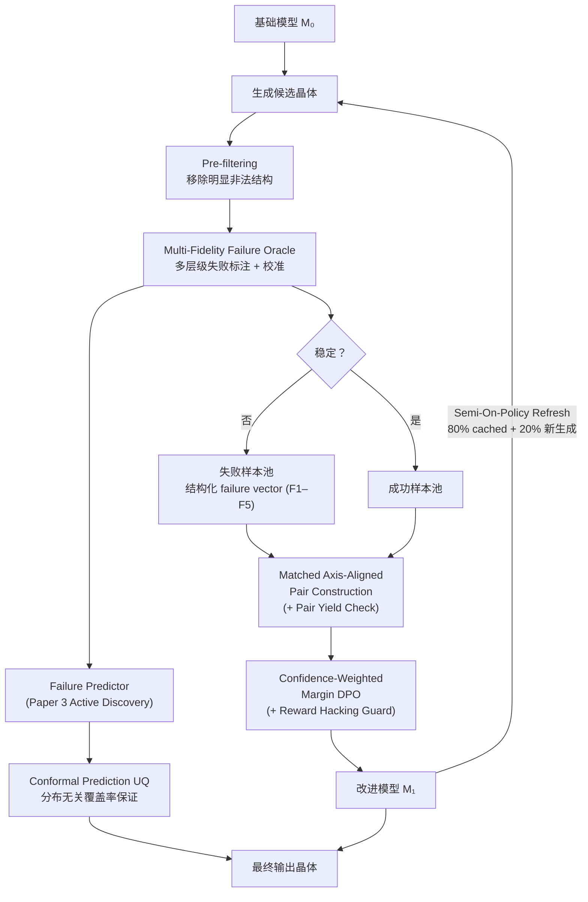
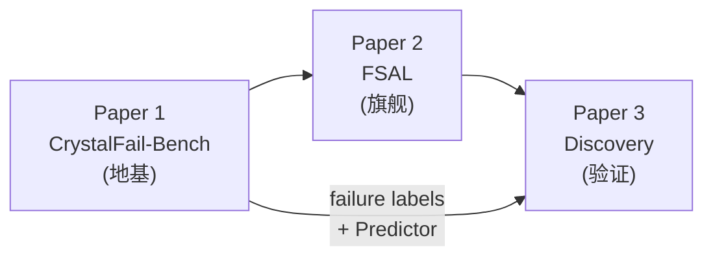

<aside>
⚡

**一句话定位（v2.2 收敛版）**：我们要证明 **failure structure is a diagnostically separable, alignable supervision space**——把晶体生成模型的失败样本从噪声变成可诊断、可分解、可对齐的结构化监督信号，系统性地改进生成质量。
**主 claim**：结构化失败监督（F1/F2/F3 为训练主轴，F4 为约束过滤，F5 为 discovery 筛选）优于 scalar reward / weighted-sum preference——更可诊断、更可解释、更鲁棒。
**次级 claim**：它能提高材料发现效率（Paper 3 延后验证）。

</aside>

<aside>
🔴

**FIIR-v2.2 方法论设计承诺（收敛版，2026-05-12 更新）**：
**① 失败标签必须是多保真、带不确定性的**：failure vector 包含 (f1, f2, f3, f4, f5, uncertainty, calibration_tier)，由多层级 oracle 交叉校准
**② F1–F5 是"诊断上可分解的"（diagnostically separable），不声称因果独立**：五个维度在诊断和干预上有用，但不假设天然正交；验证目标是可分解性和部分可控性
**③ 维度角色分级：训练主轴 F1/F2/F3，约束过滤 F4，discovery 筛选 F5**：F4（泄漏/新颖性）用于 pair 过滤和 benchmark 可信度，不作为 DPO 训练目标；F5（可合成性）仅在 Paper 3 中使用，不进入训练 loss
**④ 偏好对构造形式化为 pair quality 优化问题**：pair quality = 主失败维度差异 × 其他维度相似度 × composition/prototype 相似度 × label confidence；实现为 weighted bipartite matching（OT 作为理论对比）
**⑤ 偏好学习必须感知置信度与失败幅度**：pair 越可靠权重越高，failure gap 决定 adaptive margin
**⑥ FSAL 必须先做最小可验证版本（Minimal Viable FSAL）**：核心四组件（pre-filtering + matched F1/F2/F3 pairs + confidence-weighted DPO + per-dimension evaluation），其他组件作为消融分层加入
**⑦ Base-model 验证降级为"可适配"**：主文在自回归基座上完整验证；扩散/flow 基座做 pilot 验证，不要求所有指标打穿
**⑧ Semi-on-policy 作为默认刷新策略**：Round 0 离线 → Round 1–2 用 80/20 → Round 3+ 按 shift 程度调整
**⑨ 明显非法结构应在配对前过滤**
**⑩ Diversity 是硬约束而非附加指标**：stable rate↑ 但 diversity↓ = 方法失败；主图必须画 Pareto front；模型选择用 Pareto 最优
**⑪ 所有实验须在 LeMat-GenBench [18] 标准评测框架上报告**
**⑫ Reward Hacking 防护采用 fixed audit + targeted audit**：固定 DFT audit set（每轮必检）+ 主动抽查高风险样本；proxy-true divergence 作为 early stopping 标准
**⑬ Taxonomy 验证以 bottom-up + counterfactual 为主，PCA 为辅**：从原始描述符做独立因子发现（不使用 F1–F5 标签），再用 counterfactual 扰动验证部分可控性
**⑭ Pair yield + coverage 必须预先评估 + 准备 Plan B**：yield 不足时先用 soft matching + causal reweighting；coverage 不足时加 coverage-aware reweighting；仍不足则转向 objective-conditioned FSAL（Plan B，适用于 crystal LLM 基座）
**⑮ Paper 1 设置 go/no-go gates，Paper 3 延后并绑定具体材料场景**
**⑯ Chemistry-aware confidence discount**：利用 MLIP ensemble disagreement 对高偏差化学体系自动降低 F3 标签的 calibration tier，防止系统偏差传播
**⑰ 已知方法论风险已显式建档**：axis-aligned pair 泛化性、counterfactual 操作可行性、与 MODPO 边界、扩散模型 DPO 适配、MLIP 偏差——五大风险均有预案

</aside>

---

## 项目意义与核心创新

### 领域痛点

2024–2026 年，晶体生成模型（MatterGen [2]、OMatG [4]、CrystalFormer-RL [1]、PLaID++ [25]）在 stable rate 上取得快速进展，但暴露出三个系统性问题：

1. **失败信息被浪费**：60–80% 的生成样本未通过稳定性验证，这些失败样本被直接丢弃——但它们包含丰富的诊断信息（为什么失败？哪个维度失败？失败多严重？）
2. **标量奖励不可解释**：CrystalFormer-RL 用 MLIP 能量做 PPO [1]，PLaID++ 用 weighted-sum 做 DPO [25]——都把多维质量信息压成单一数字，导致模型改善/退化无法归因到具体失败维度
3. **泄漏与 reward hacking 威胁可信度**：MatterGen 被确认存在训练集泄漏 [3]；基于 MLIP proxy 的 RL/DPO 方法面临 Goodhart's Law 风险 [49]——但目前没有工作系统性地建模和防护这些问题

### FIIR 的五个核心创新

| #     | 创新点                                                                      | 与现有工作的本质区别                                                                                                                                                                                    |
| ----- | --------------------------------------------------------------------------- | ------------------------------------------------------------------------------------------------------------------------------------------------------------------------------------------------------- |
| **①** | **Failure-as-supervision 范式转换**                                         | 现有方法只利用成功样本或将失败压成 scalar reward；FIIR 首次在晶体生成领域建立系统性失败分析框架，将失败样本转化为结构化、多维、带置信度的监督信号                                                       |
| **②** | **Confounder-controlled preference construction（混杂变量控制的偏好构造）** | MODPO [32] / D2-DPO [50] 等 multi-objective DPO 仅按分数排序构造 pair，不控制混杂变量；FSAL 要求 composition/prototype 匹配后比较单一维度——本质是 **proximal causal inference**，类比 RCT vs 观察性研究 |
| **③** | **Full-chain confidence-aware learning（全链路置信度感知）**                | 标签不确定性从 oracle 分歧 → calibration tier → pair weight → DPO margin 全链路传播；chemistry-aware confidence discount 主动降低 MLIP 高偏差体系权重                                                   |
| **④** | **Self-consistent evaluation + 泄漏检测（评估可信度保障）**                 | 直接回应 MatterGen 泄漏批评 [3]：self-consistent MLIP hull [18] + F4 维度 + StructureMatcher 去重，从评估方法层面提升领域可信度                                                                         |
| **⑤** | **Reward hacking 显式建模与防护**                                           | 晶体生成领域首次系统性处理 proxy-true divergence：fixed DFT audit + targeted audit + $\Delta_{\text{proxy-true}}$ early stopping，将 reward hacking 从事后分析升级为训练流程内置防线                    |

### 学术定位与边界

<aside>
🎯

**主 claim**（Paper 1 + 2 验证）：结构化失败监督优于 scalar reward / weighted-sum preference——更可诊断、更可解释、更鲁棒
**次级 claim**（Paper 3 延后验证）：它能提高材料发现效率
**明确不声称**：五维天然正交（只声称诊断可分解）；全基座通用（只声称 adaptable）；取代预训练范式（定位为 post-training alignment，可叠加在任何基座之上）

</aside>

---

## 第一部分：核心科学问题

FIIR 的研究纲领围绕以下九个核心科学问题展开。每个问题对应一组必须通过实验验证的假设。

### 九个科学问题

1. **Failure Decomposability（失败可分解性）**：晶体生成失败是否可以被分解为几何、化学、热力学等诊断上可分解的维度（diagnostically separable and partially controllable, but not assumed causally independent）？该分解是否经得起数据驱动验证（以 bottom-up factor discovery + counterfactual perturbation 为主，PCA 为辅）？
2. **Failure Learnability（失败可预测性）**：这些失败维度是否可以由模型从晶体结构中直接预测？Failure Predictor 是否能跨生成模型泛化？
3. **Structured Supervision（结构化监督的价值）**：带置信度校准的结构化失败反馈是否优于 binary feedback 或 scalar reward？
4. **Axis-Aligned Preference（维度解耦偏好的价值）**：化学/结构匹配后的 axis-aligned 偏好对是否优于 weighted-sum scalar preference？
5. **Confidence-Aware Learning（置信度感知学习）**：利用 failure gap + pair confidence 加权训练信号，是否比 uniform-weight 偏好学习更稳健？
6. **Base-Model Agnosticism（基座无关性）**：FSAL 是否在自回归（CrystalFormer）和扩散/flow 基座（DiffCSP++/OMatG）上均有效？
7. **Discovery Utility（发现实用性）**：失败感知生成模型是否能在固定计算预算下提高 DFT 验证通过的新材料命中率？
8. **Reward Robustness（奖励鲁棒性）**：基于 MLIP proxy 的偏好学习是否会引发 reward hacking（Goodhart's Law）？显式的 proxy-true divergence 监控能否有效缓解？
9. **Synthesizability Awareness（可合成性感知）**：将可合成性作为独立失败维度纳入 failure vector，是否能提升最终推荐结构的实验可实现率？

### 核心假设（必须通过实验验证）

1. 失败可以被结构化分解为多个诊断上可分解的维度（diagnostically separable, not assumed causally independent），且该分解是数据驱动可验证的（Paper 1：以 bottom-up SOAP/Matminer 因子发现 + counterfactual 扰动为主验证，PCA 为辅助分析）
2. 带置信度校准的结构化失败反馈 > binary/scalar 反馈（Paper 2 核心消融）
3. 化学/结构匹配后的 near-miss 偏好对 > 随机负样本的偏好对（Paper 2 核心消融）
4. 训练时结构化对齐（FSAL）> 推理时引导（路线 C），证明失败信息值得纳入训练（Paper 2 消融）
5. 多样性可在偏好学习中被显式保持：Soft Preference Learning [31] 的 entropy 解耦使 stability 提升不以 diversity 坍缩为代价
6. Confidence-Weighted Margin DPO 优于普通 DPO：利用 failure gap + pair confidence 加权训练信号（Paper 2 核心消融）
7. FSAL 是 base-model adaptable 的：在自回归基座上完整验证，在至少一个扩散/flow 基座上做 pilot 验证证明方法思想可迁移（Paper 2）
8. Reward hacking 可通过 DFT spot-check + conservative reward estimation + proxy-true divergence 监控有效缓解（Paper 2 消融）
9. 可合成性失败（F5）与热力学失败（F3）提供非冗余信息：亚稳但可合成的结构不应被 F3 单独排除（Paper 1 + Paper 3）

---

## 第二部分：FIIR 方法总架构

### 六层方法架构

| 层级                       | 方法职责                                                                                                              | 对应论文    |
| -------------------------- | --------------------------------------------------------------------------------------------------------------------- | ----------- |
| **Generation Space**       | 提供不同晶体生成模型产生的候选结构，FIIR 不绑定单一基座                                                               | Paper 2     |
| **Failure Observation**    | 观察候选结构如何失败，而不是只判断成功/失败                                                                           | Paper 1     |
| **Failure Representation** | 将失败表达为五维、连续、带不确定性和校准层级的 failure vector（F1–F5）                                                | Paper 1     |
| **Failure-Aware Learning** | 将 failure vector 转化为 matched axis-aligned preference pairs + confidence-weighted alignment + reward hacking guard | Paper 2     |
| **Evaluation**             | 检验质量、稳定性、多样性、novelty、泄漏控制、可合成性和 Pareto 改进                                                   | Paper 1 + 2 |
| **Active Discovery**       | 将 Failure Predictor 从评估器升级为 critic + constrained qEHVI acquisition，服务真实材料发现                          | Paper 3     |

---

## 第三部分：Failure Representation 框架

### 五维失败分类体系

| 维度                 | 描述                                                                                                                                                             | 输出类型       | 置信度特征                                  | 标注工具                                                    |
| -------------------- | ---------------------------------------------------------------------------------------------------------------------------------------------------------------- | -------------- | ------------------------------------------- | ----------------------------------------------------------- |
| **F1: 几何合法性**   | 结构是否存在原子间距异常、晶格参数不合理、对称性严重畸变等几何失败                                                                                               | 连续 (0–1)     | 规则检测通常高置信；边界结构置信度降低      | pymatgen + spglib + 自定义规则                              |
| **F2: 化学合法性**   | 组成、价态（BVS [15]）、配位（CrystalNN [16]）和局域化学环境是否合理（SMACT [12]）                                                                               | 连续 (0–1)     | 对复杂多元体系不稳定，置信度动态调整        | SMACT + BVS + CrystalNN                                     |
| **F3: 热力学稳定性** | 结构相对于 **self-consistent MLIP hull** 的能量稳定性（$E_{\text{hull}}$）；用同一 MLIP 对生成结构和参考结构统一重算，保证标注一致性（参考 LeMat-GenBench [18]） | 连续 (eV/atom) | 多代理模型一致→高置信；分歧大→低置信        | MACE-MP-0 / CHGNet / M3GNet ensemble + self-consistent hull |
| **F4: 新颖性与泄漏** | 生成结构是否为训练集近重复（StructureMatcher 去重）或已知结构的微扰；直接回应 MatterGen 泄漏批评 [3]                                                             | 连续 (0–1)     | 与训练集相似度高→高置信判定为泄漏           | StructureMatcher + Fingerprint 距离                         |
| **F5: 可合成性**     | 结构是否具备实验合成可达性（区别于热力学稳定性：亚稳但可合成 vs 稳定但无法合成）                                                                                 | 连续 (0–1)     | CLscore 边界区域置信度低，需 CSLLM 二次验证 | CLscore（PU Learning）[43] + CSLLM [17] 二次验证            |

### Failure Vector 完整格式

`(f1, f2, f3, f4, f5, uncertainty, calibration_tier)`

- **f1–f5**：五维连续失败分数
- **uncertainty**：标签整体不确定性，由多 oracle 分歧度决定
- **calibration_tier**：标签可信度层级

### Calibration Tier 分级

Calibration Tier 决定失败标签的可信度，直接影响偏好学习中的 pair weight。

| Tier       | 来源                         | 方法含义                             |
| ---------- | ---------------------------- | ------------------------------------ |
| **Tier 1** | 高保真计算验证（DFT 校准集） | 最可靠的标签，作为其他层级的校准基准 |
| **Tier 2** | 多代理模型一致判定           | 多个独立 oracle 达成共识，可信度高   |
| **Tier 3** | 单一代理模型 + 规则一致      | 中等可信度，可能存在系统偏差         |
| **Tier 4** | 仅规则检测或 oracle 分歧大   | 低可信度，需在偏好学习中降权         |

### Chemistry-Aware Confidence Discount（v2.2 新增）

MLIP 对不同化学体系的准确度差异很大（如过渡金属氧化物、含 f 电子体系、分子晶体偏差较高）。为防止 F3 标签的系统性偏差传播到训练信号中，新增自动化置信度折扣机制：

- **检测**：利用 MLIP ensemble disagreement（σ_ensemble）和已知 domain of applicability 信息，识别高偏差化学体系
- **降级**：σ_ensemble 超过阈值的结构，F3 的 calibration tier 自动降一级（如 Tier 2 → Tier 3）
- **效果**：高偏差体系的 pair 在 DPO 中被降权，减少系统偏差向生成模型的传播
- **成本**：零额外 DFT 开销，只利用 MLIP ensemble 已有的分歧信号

### F4/F5 在训练与发现中的角色

<aside>
📌

**维度角色分级（v2.2 核心调整）**

**F1/F2/F3 = 训练主轴（结构本身的物理/化学失败）**：几何合法性、化学合法性、热力学稳定性——这三个维度直接对应晶体结构的物理/化学质量，是 FSAL 偏好学习的训练目标。Axis-aligned pairing 仅在 F1/F2/F3 上构造。

**F4 = 约束与过滤（benchmark 可信度 + 去重/泄漏控制）**：在 Paper 1 中作为评测维度直接回应 MatterGen 泄漏批评 [3]；在 Paper 2 中用于过滤训练集近重复结构。**不作为 DPO 优化目标**——否则可能鼓励模型生成"离数据库很远但物理很怪"的结构。

**F5 = Discovery 筛选与后验分析**：不进入训练 loss。在 Paper 3 validation ladder 中作为 DFT 前筛选。**不作为强训练标签**——历史合成数据存在报道偏差与合成条件依赖，作为 DPO 目标会引入系统性偏差。F5 与 F3 提供非冗余信息：亚稳但可合成的结构不应被 F3 单独排除。标注：CLscore [43] + CSLLM [17]。

</aside>

### 数据驱动验证原则（v2.2 修订版——以 bottom-up + counterfactual 为主）

Failure taxonomy 不能仅凭先验知识定义，必须经数据驱动验证。**关键立场（v2.2）**：我们不再声称 F1–F5 "正交/独立"，而是验证它们"诊断上可分解且部分可控"（diagnostically separable and partially controllable）：

1. **[主验证] Bottom-up descriptor 因子发现**：从 SOAP/Matminer/graph descriptors 等原始结构描述符出发，**不使用 F1–F5 标签**，做独立因子分析。若自发涌现的潜在因子与 F1–F5 高度对齐，则说明维度反映数据内在结构而非先验偏见
2. **[主验证] Counterfactual 扰动实验**：通过定向干预验证各轴的部分可控性。**不追求完全隔离单轴**（物理耦合是真实的），而是量化**主效应比** ≡ ΔF_target / max(ΔF_other)，验证修复操作的主效应集中在目标维度。**三种具体操作**：
   - **几何 counterfactual（targeting F1）**：对 F1 失败结构，做 constrained MLIP relaxation（仅弛豫原子位置，固定晶格参数 + 化学组成）。预期：ΔF1 ≫ ΔF2 ≈ 0，ΔF3 变化是次要效应
   - **化学 counterfactual（targeting F2）**：对 F2 失败结构，做 isovalent substitution（同 prototype 不同组成，SMACT 确保价态合理）。预期：ΔF2 ≫ ΔF1 ≈ 0，ΔF3 随组成变化
   - **稳定性 counterfactual（targeting F3）**：对 F1/F2 合格但 F3 失败的结构，做 full MLIP relaxation（弛豫位置 + 晶格）。预期：ΔF3 ≫ ΔF1 ≈ ΔF2 ≈ 0
   - **验证标准**：主效应比 > τ（建议 τ ≥ 3），在各化学体系和 prototype 上统计该比值的分布；若分布集中在 τ 以上，则支持该轴的部分可控性
3. **[辅助] Top-down PCA/factor analysis**：对失败样本的 F1–F5 做 PCA 作为辅助分析。**PCA 局限性**：若输入本身就是 5 维 failure vector，前 5 主成分天然解释全部方差——因此 PCA 不能作为维度可分解性的主要证据
4. **跨模型稳定性**：验证同一 taxonomy 在 CrystalFormer、OMatG、DiffCSP++ 等不同基座生成的样本上的一致性

<aside>
⚠️

**PCA 局限性与循环论证风险（v2.2 更新）**：① F1/F2/F3 由不同物理方法计算（规则检测 vs SMACT/BVS vs MLIP），PCA 显示的多主成分可能仅反映计算方法差异；② 5 维输入的 PCA 前 5 主成分天然解释全部方差，证明力不足。因此 **bottom-up 因子发现 + counterfactual 扰动是主验证方法**，PCA 仅作辅助。验证目标不是"正交性"，而是"诊断可分解性与部分可控性"。

</aside>

### Multi-Fidelity Labeling 原则

失败标签不应来自单一 oracle，而应来自多保真信息源：

| 信息来源层级                  | 方法角色                                                                                                               |
| ----------------------------- | ---------------------------------------------------------------------------------------------------------------------- |
| 物理规则与约束                | 捕捉明显非法结构（pre-filtering）                                                                                      |
| 代理模型集成（MLIP ensemble） | 提供中等成本的稳定性与化学合理性估计；**须用 self-consistent hull**（用同一 MLIP 统一重算生成结构和参考结构的 E_hull） |
| 高保真计算（DFT）             | 校准标签、估计系统偏差、最终验证                                                                                       |
| 数据库比对                    | novelty 和 leakage control（F4）                                                                                       |
| 可合成性预测模型              | CLscore + CSLLM 评估合成可达性（F5）                                                                                   |

不同来源之间的一致性用于估计标签置信度；分歧本身也是重要信号，应被编码为 uncertainty 而非被忽略。

---

## 第四部分：Preference Learning 方法论

### 为什么不能用 scalar reward

把 F1–F5 压成一个加权总分 $\alpha_1 F_1 + \alpha_2 F_2 + \cdots + \alpha_5 F_5$ 有三个根本问题：

1. **信息损失**：不同失败原因被混合，无法诊断哪一类失败被改善
2. **权重任意性**：权重难以科学确定，且最优权重可能随训练阶段变化
3. **不可解释性**：模型变好或变坏时，无法归因到具体失败维度

FIIR 的核心立场：**多维失败信息应尽可能晚地聚合，而不是在训练信号构造前过早压缩。**

### 路线 A（推荐）：Failure-Structured Alignment（FIIR-v2 主方法）

<aside>
🅰️

**FIIR-v2.2 主力方法。按最小可验证原则分为核心层和消融层。**

**━━ 核心层（Minimal Viable FSAL）━━**

**1. Pre-filtering**：明显非法结构在 pair 构造前直接过滤

**2. Matched Axis-Aligned Pairing（仅 F1/F2/F3，形式化为 pair quality 优化）**：
• **训练主轴仅限 F1/F2/F3**。F4 用于 pair 前过滤（剔除训练集近重复），F5 不参与
• **Per-axis 配对**：F1 pair——主要差几何，F2/F3/composition 接近；F2 pair——主要差化学，F1/F3 接近；F3 pair——主要差稳定性，F1/F2 已合格
• **Pair quality 形式化**：score = 主维度差异 × 其他维度相似度 × composition/prototype 相似度 × label confidence × F4 合格性。实现为 weighted bipartite matching（soft OT 作为理论对比）
• **Pair Yield + Coverage 保障**：Paper 1 pilot study 验证各 axis yield（目标 >10%）**和 pair coverage**（pair 须覆盖主要 composition space 和 prototype space，不能集中在少数化学体系）→ yield 不足用 soft matching + causal reweighting [40]（Plan A）→ coverage 不足加 coverage-aware reweighting → 仍不足转 objective-conditioned FSAL（Plan B，见路线 D）

**3. Confidence-Weighted DPO**：用 calibration tier 作为 pair weight $w_{ij}$，可靠 pair 权重高，不确定 pair 降权/剔除

**4. Per-Dimension Evaluation**：分别报告 F1/F2/F3 改善，Pareto front（stable rate vs diversity）为主图

**━━ 消融层（分层加入，按优先级排序）━━**

**5. Adaptive Margin（消融 A）**：$m_{ij}$ = f(failure_gap, pair_confidence)，failure gap 越大 margin 越高

**6. Near-Miss Sampling（消融 B）**：优先选取 $E_{\text{hull}}$ 0.05–0.15 eV/atom 的 near-miss 作为负例，而非 catastrophic failure

**7. Semi-On-Policy Refresh（消融 C）**：Round 0 离线 pair pool → Round 1–2 用 80/20 cached/fresh → Round 3+ 按 distribution shift 调整 fresh ratio。仅对 predicted near-miss 做完整 MLIP ensemble，其余用 Failure Predictor 预筛

**8. Diversity Preservation（硬约束）**：composition entropy + space group coverage + unique/novel rate 作为模型选择硬约束（不满足 = 方法失败）。Pareto front（stable rate vs diversity）为 Paper 2 主图

**9. Reward Hacking Guard（必备防线）**：fixed DFT audit set（每轮必检）+ uncertainty-triggered audit + novelty-triggered audit。$\Delta_{\text{proxy-true}}$ 作为 early stopping 和模型选择标准

**10. MapReduce LoRA Variant（实验变体，非主方法）**：per-axis LoRA experts 并行训练 + 迭代合并 [29]，仅作为实验变体验证 axis decomposition 的另一种实现

</aside>

### 路线 B：Failure-Conditioned Repair

<aside>
🅱️

**高风险高回报的互补方案。** 学习如何把失败晶体修复为可行晶体——输入失败晶体 + failure code，输出修复结构。类比 NLP 中的 self-correction（Reflexion, SPIRAL）。

**方法定位**：
• FSAL（路线 A）是主线，改善生成分布
• Repair 是第二阶段 refiner，仅处理 near-miss candidates（$E_{\text{hull}}$ 0.05–0.15 eV/atom）
• 修复手段限制为局部弛豫（lattice strain relaxation + Wyckoff position refinement），不改变化学组成
• 不修 catastrophic failure，不作为 Paper 2 核心贡献
• 在 Paper 2 中作为消融实验而非核心方法

</aside>

### 路线 C：推理时失败引导（Inference-Time Failure Guidance）

<aside>
🔷

**最轻量替代方案，作为 baseline。** 不修改基座模型权重，推理时用 Failure Predictor 梯度引导采样。类似 OMatG-IRL [26] 与 Self-Correcting Search [28]，但使用 5 维 failure score 而非 scalar energy。

**关键价值**：证明训练时对齐（路线 A）相比推理时引导的增量价值。

</aside>

### 已知方法论风险与预案（v2.2 新增）

<aside>
⚠️

**五个必须正视的方法论风险及应对策略**

**风险 1（🔴 高）：Axis-aligned pair 的物理级联耦合与泛化性**
F1 崩坏几乎必然导致 F3 异常（原子重叠 → 巨大排斥能），"F1 差但 F3 好"的 pair 可能极稀少。即使 yield 够，pair 可能来自数据分布的 thin slice，泛化性存疑。
**应对**：Paper 1 pilot study 必须同时报告 **pair yield + pair coverage**（pair 是否覆盖主要 composition space 和 prototype space）。覆盖度不足时加 coverage-aware reweighting。最终后备：Plan B objective-conditioned FSAL。

**风险 2（🟡 中高）：Counterfactual 扰动无法完全隔离单轴**
"Fix 几何但保持能量不变"在物理上不可能——任何弛豫都会改变能量。
**应对**：不追求完全隔离，改为量化**主效应比**（ΔF_target / max(ΔF_other) > τ，建议 τ ≥ 3）。三种具体操作方案见"数据驱动验证原则"部分。

**风险 3（🟡 中）：与 multi-objective DPO 的边界模糊**
审稿人可能质疑"这不就是 per-objective DPO"。
**应对**：核心区别是 **confounder-controlled vs uncontrolled** pair construction。Paper 2 须设计直接消融：matched pairing vs unmatched per-objective DPO，量化匹配带来的增量。

**风险 4（🟡 中）：DPO 在扩散/flow 模型上的适配缺失**
CrystalFormer 有 token-level log-prob，但 OMatG/DiffCSP++ 的 log-likelihood 需 ODE 积分，成本高且不稳定。FlowDPO [46] 实为 LLM 方法，非扩散模型 DPO。
**应对**：主文仅在自回归基座上完整验证。扩散/flow pilot 使用 denoising score matching loss 作为 implicit log-prob proxy（类比 DiffusionDPO, Wallace et al. 2024），或用 reward-weighted regression 替代严格 DPO。Pilot 定位为概念验证。

**风险 5（🟢 中低）：F3 标签受 MLIP 系统偏差限制**
Self-consistent hull 解决一致性但不解决准确性。MLIP 对某些化学体系（过渡金属氧化物、含 f 电子体系）存在系统偏差。
**应对**：新增 chemistry-aware confidence discount——利用 MLIP ensemble disagreement 对高偏差化学体系自动降低 F3 的 calibration tier。不需额外 DFT，只利用 MLIP 自身不确定性信号。

</aside>

---

## 第五部分：三篇论文路线

| 论文                           | 核心方法任务                                                                          | 目标 Venue         | 逻辑依赖                          |
| ------------------------------ | ------------------------------------------------------------------------------------- | ------------------ | --------------------------------- |
| **Paper 1: CrystalFail-Bench** | 定义、验证并预测晶体生成失败的五维结构化表示（F1–F5）；包含 pair yield pilot study    | NeurIPS D&B / ICLR | 无                                |
| **Paper 2: FSAL**              | 将结构化失败信号转化为 axis-aligned preference alignment + reward hacking guard       | NeurIPS / ICML     | Paper 1 的 failure representation |
| **Paper 3: Discovery**         | 验证失败感知生成模型在 active discovery 中的实用价值（constrained qEHVI + 多保真 BO） | npj Comp. Mat.     | Paper 1 + Paper 2                 |

---

## 第六部分：验证框架与评价哲学

### Claim-Based Validation Matrix

每组实验必须对应一个明确的科学 claim，而非单纯"跑消融"。

| Scientific Claim                            | 需要的验证对比                                                                                                          | 主要论文 |
| ------------------------------------------- | ----------------------------------------------------------------------------------------------------------------------- | -------- |
| **失败结构可分解（5维）**                   | F1–F5 的 PCA + bottom-up SOAP/Matminer 因子发现 + counterfactual 扰动 + 跨模型稳定性                                    | Paper 1  |
| **失败结构可预测**                          | Failure Predictor 精度 + 跨模型泛化 + 推理加速比                                                                        | Paper 1  |
| **Calibration Tier 有效**                   | 各 Tier 标签准确率 + DFT 校准集上的一致率                                                                               | Paper 1  |
| **Pair yield 充足**                         | 各 failure axis 的 matched pair yield 统计 + soft matching 补救效果                                                     | Paper 1  |
| **F4 泄漏检测有效**                         | 在已知泄漏数据集（如 MatterGen 被批评的结构）上的 recall + precision                                                    | Paper 1  |
| **结构化反馈 > 二值/标量反馈**              | FSAL vs Binary DPO / Energy-only PPO [1] / Rejection Sampling                                                           | Paper 2  |
| **Axis-aligned > weighted-sum**             | FSAL vs Weighted-Sum DPO / PLaID++ 复现 [25]（Head-to-head 核心 claim）                                                 | Paper 2  |
| **Matched pairing > 无匹配 pairing**        | Matched pairing vs 纯 score-aligned / random negative                                                                   | Paper 2  |
| **CW-Margin > 普通 DPO**                    | CW-Margin DPO vs 标准 DPO（核心消融）                                                                                   | Paper 2  |
| **Near-miss 有训练价值**                    | Near-miss vs catastrophic vs random negative                                                                            | Paper 2  |
| **训练时对齐 > 推理时引导**                 | FSAL vs 推理时 Failure-Guided Sampling（路线 C）                                                                        | Paper 2  |
| **On-policy > off-policy**                  | Semi-on-policy refresh vs 固定 pair 不刷新 vs 全量 on-policy                                                            | Paper 2  |
| **Reward hacking 可缓解**                   | 有 DFT spot-check + conservative reward vs 无防护；监控 $\Delta_{\text{proxy-true}}$ 随轮次变化                         | Paper 2  |
| **FSAL 是 base-model agnostic**             | CrystalFormer + DiffCSP++/OMatG 双基座验证；可选加入 WyckoffDiff [45] 作为第三基座                                      | Paper 2  |
| **质量提升不牺牲多样性**                    | Stability-Diversity Pareto front + Soft Preference Learning [31] + MapReduce LoRA [29]                                  | Paper 2  |
| **FIIR 提升 discovery hit rate**            | 端到端 pipeline 对比（Baseline / CrystalFormer-RL / PLaID++ / OMatG-IRL / FSAL）+ DFT 验证 + CLscore/CSLLM 可合成性筛选 | Paper 3  |
| **Conformal UQ 优于 ensemble disagreement** | Conformal prediction [42][44] vs MLIP ensemble std 在 validation ladder 中的覆盖率与校准性对比                          | Paper 3  |

### 评价哲学

FIIR 的评价不能只看单一指标，必须同时覆盖：

- **质量**：Stable Rate / SUN Rate（↑）；各维度失败率 F1–F5（↓）
- **多样性**：Unique / Novel / 空间群覆盖 / 组成熵（→ 不坍缩）
- **可合成性**：CLscore / CSLLM 通过率（↑，Paper 3 重点关注）
- **标准评测**：在 LeMat-GenBench [18] 公开 leaderboard 上报告，确保与社区可比
- **Pareto 分析**：绘制 stable rate vs novelty/diversity Pareto front，展示方法在多个 operating point 上的优势，而非单点比较
- **泄漏控制**：生成结构须与训练集去重（StructureMatcher），确保指标的可信度；F4 维度提供定量泄漏评估
- **模式坍缩缓解**：混入原始训练数据；entropy 解耦；组成熵持续监控
- **Reward hacking 监控**：$\Delta_{\text{proxy-true}}$ 随训练轮次变化曲线，确保 MLIP proxy 优化不偏离 DFT 真值

### 数据集选择

- **主训练集**：Alexandria（Alex-20, Schmidt et al. 2024）[13]——与 CrystalFormer-RL 相同训练集，确保公平对比
- **验证集**：留出已知稳定晶体
- **数据库比对**：ICSD、Materials Project、GNoME
- **Self-consistent hull 参考集**：用 MACE-MP-0 对 MP 参考结构统一重算能量，构建与生成结构可比的 energy hull

---

## 第七部分：与现有工作的本质差异

### 五个核心差异

1. **从 success-oriented evaluation 到 failure-oriented diagnosis**：不是只问模型生成了多少好结构，而是系统分析模型为什么失败
2. **从 scalar reward 到 structured failure supervision**：不把稳定性、化学合理性、几何合法性、新颖性、可合成性混成一个总分
3. **从 random/unmatched negative 到 confounder-controlled preference**：偏好对不是随机挑坏样本或仅按分数排序，而是在控制 composition/prototype 等混杂变量后做单维度比较——本质区别于 MODPO [32] / D2-DPO [50] 等 multi-objective DPO 方法的无匹配 pair 构造
4. **从 point estimate 到 confidence-aware learning**：标签不确定性全链路传播（oracle 分歧 → calibration tier → pair weight → DPO margin），而非假设所有标签等可信
5. **从 static screening 到 active discovery loop**：Failure Predictor 不只是筛选器，而是 discovery acquisition 的组成部分

### 详细对比

| 现有工作                                         | 做法                                                     | 我们的差异                                                                                                                                                                  |
| ------------------------------------------------ | -------------------------------------------------------- | --------------------------------------------------------------------------------------------------------------------------------------------------------------------------- |
| **CrystalFormer-RL** (Cao & Wang, 2025) [1]      | MLIP 标量 reward + PPO                                   | 用结构化失败归因 + axis-aligned 偏好 + reward hacking 防护，非单一标量奖励                                                                                                  |
| **MatterGen** (Zeni et al., _Nature_ 2025) [2]   | 扩散模型 + adapter 条件化                                | 已被确认存在训练集泄漏问题 [3]；我们通过 F4 维度显式检测泄漏 + 失败学习提高质量                                                                                             |
| **OMatG** (Höllmer et al., ICML 2025) [4]        | 随机插值 + flow matching                                 | 方法不绑定基座架构，可在 OMatG 之上叠加                                                                                                                                     |
| **PLaID++** (Xu et al., ICML 2026) [25]          | Iterative DPO on crystal LLM（weighted-sum 标量 reward） | 仅用 weighted-sum 标量做 DPO；我们用结构化失败归因 + axis-aligned 偏好解耦 + near-miss mining + reward hacking guard                                                        |
| **OMatG-IRL** (Höllmer & Martiniani, 2026) [26]  | 推理时 policy-gradient RL on flow-based 模型             | 仅使用 scalar energy objective；我们的结构化失败信号更丰富，且训练时改变模型内部分布                                                                                        |
| **DAO** (Nature Comm. 2026) [27]                 | Siamese foundation models（协同预训练）                  | DAO 是预训练范式；我们是 post-training alignment，可叠加在 DAO 之上                                                                                                         |
| **Self-Correcting Search** (Goodfire, 2026) [28] | 推理时 probe-guided 纠错                                 | 依赖可解释性探针且仅限推理时；我们的训练时对齐更彻底                                                                                                                        |
| **MapReduce LoRA** (Chen et al., CVPR 2026) [29] | 多偏好 LoRA experts 并行训练 + 迭代合并                  | NLP/CV 通用框架；我们适配为晶体领域 axis-aligned LoRA variant                                                                                                               |
| **SHAFT** (Digital Discovery 2026) [30]          | 层级 GFlowNet + 对称性感知                               | GFlowNet 的 reward-proportional sampling 与 DPO 是不同范式；我们在 DPO 框架内通过 Soft Preference Learning [31] 解决多样性问题，保持 likelihood-based optimization 的可控性 |
| **WyckoffDiff** (2025) [45]                      | Wyckoff-aware 扩散模型                                   | 可作为第三基座验证 FSAL 的 base-model agnosticism；扩散模型的 DPO 适配需借鉴 FlowDPO [46]                                                                                   |
| **PackFlow** (2026) [47]                         | Flow model + MLIP energy/force alignment                 | 仅用 energy+force 做 alignment reward；我们的 5 维结构化 failure vector 信息量更大                                                                                          |

---

## 参考文献

1. Cao & Wang, "CrystalFormer-RL: Reinforcement Fine-Tuning for Materials Design", arXiv:2504.02367, 2025. https://arxiv.org/abs/2504.02367
2. Zeni et al., "MatterGen: A generative model for inorganic materials design", Nature, 2025. https://www.nature.com/articles/s41586-025-08628-5
3. "Continued challenges in high-throughput materials predictions: MatterGen predicts compounds from the training dataset", Materials Horizons, 2026. https://pubs.rsc.org/en/content/articlehtml/2026/mh/d6mh00268d
4. Höllmer et al., "Open Materials Generation with Stochastic Interpolants", ICML 2025. https://arxiv.org/abs/2502.02582
5. Guo, "Train Separately, Compose at Sampling: Multi-Property Crystal Generation with Orthogonal Flow Guidance", AI4Mat-ICLR 2026 Workshop. https://openreview.net/forum?id=PjkeOpfo8c
6. Ong et al., "Python Materials Genomics (pymatgen)", Comp. Mater. Sci., 2013.
7. Larsen et al., "The Atomic Simulation Environment", J. Phys. Condens. Matter, 2017.
8. Batatia et al., "MACE: Higher Order Equivariant Message Passing Neural Networks", NeurIPS 2022; MACE-MP-0: arXiv:2401.00096.
9. Deng et al., "CHGNet: Pretrained universal neural network potential", Nat. Mach. Intell., 2023.
10. Chen & Ong, "A universal graph deep learning interatomic potential (M3GNet)", Nat. Comp. Sci., 2022.
11. Togo et al., "Spglib: a software library for crystal symmetry search", 2024.
12. Davies et al., "SMACT: Semiconducting Materials by Analogy and Chemical Theory", JOSS, 2019.
13. Schmidt et al., "Alexandria: Improving machine-learning models through large datasets", 2024. https://alexandria.icams.rub.de/
14. Rafailov et al., "Direct Preference Optimization", NeurIPS 2023. https://arxiv.org/abs/2305.18290
15. Brown, "The Chemical Bond in Inorganic Chemistry: The Bond Valence Model", Oxford Univ. Press, 2002.
16. Pan et al., "Benchmarking Coordination Number Prediction Algorithms (CrystalNN)", Inorg. Chem., 2021.
17. Sun et al., "Accurate prediction of synthesizability and precursors via large language models (CSLLM)", Nature Comm., 2025. https://doi.org/10.1038/s41467-025-61778-y
18. Betala et al., "LeMat-GenBench: A Unified Evaluation Framework for Crystal Generative Models", AI4Mat-NeurIPS 2025 Workshop. https://arxiv.org/abs/2512.04562
19. Xie et al., "Crystal Diffusion Variational Autoencoder (CDVAE)", ICLR 2022.
20. Jiao et al., "DiffCSP++: Space Group Constrained Crystal Generation", ICLR 2024.
21. Schütt et al., "SchNet / PaiNN: Equivariant Message Passing", ICML 2021.
22. Baird et al., "matbench-genmetrics", JOSS 2024.
23. Ye et al., "Con-CDVAE + Active Learning for Crystal Inverse Design", 2025.
24. "Generative AI for crystal structures: a review", npj Comp. Mat., 2025.
25. Xu et al., "PLaID++: A Preference Aligned Language Model for Targeted Inorganic Materials Design", ICML 2026. https://arxiv.org/abs/2509.07150
26. Höllmer & Martiniani, "Open Materials Generation with Inference-Time Reinforcement Learning", AI4Mat-ICLR 2026 Workshop. https://arxiv.org/abs/2602.00424
27. DAO: "Siamese Foundation Models for Crystal Structure Prediction", Nature Communications, 2026.
28. Goodfire, "Using Self-Correcting Search to Accelerate Materials Discovery", 2026.
29. Chen et al., "MapReduce LoRA: Advancing the Pareto Front in Multi-Preference Optimization", CVPR 2026 Highlight. https://arxiv.org/abs/2511.20629
30. "Efficient symmetry-aware materials generation via hierarchical generative flow networks (SHAFT)", Digital Discovery, 2026.
31. Slocum et al., "Diverse Preference Learning for Capabilities and Alignment (Soft Preference Learning)", NeurIPS 2025. https://arxiv.org/abs/2511.08594
32. Zhou et al., "Beyond One-Preference-Fits-All: Multi-Objective Direct Preference Optimization (MODPO)", ACL 2024.
33. "A framework to evaluate ML crystal stability predictions", Nature Machine Intelligence, 2025.
34. MatInvent: "Reinforcement Learning for 3D Crystal Diffusion Generation", ICLR 2025.
35. Rho, "Margin Adaptive DPO (MADPO)", TMLR. https://arxiv.org/abs/2510.05342
36. Sun et al., "γ-PO: Robust Preference Optimization via Dynamic Target Margins", ACL 2025 Findings.
37. Afzali et al., "CW-PO: Confidence-Weighted Preference Optimization", ICLR 2026. https://arxiv.org/abs/2603.04968
38. Wu et al., "AlphaDPO: Adaptive Reward Margin for Direct Preference Optimization", ICML 2025.
39. Kobalczyk & van der Schaar, "Preference Learning for AI Alignment: a Causal Perspective", ICML 2025.
40. Causal DPO for Language Model Alignment, EACL 2026 Findings. https://aclanthology.org/2026.findings-eacl.58.pdf
41. Zhang et al., "LoRI: Reducing Cross-Task Interference in Multi-Task Low-Rank Adaptation", COLM 2025.
42. Flexible Uncertainty Calibration for Machine-Learned Interatomic Potentials, 2025. https://arxiv.org/abs/2510.00721
43. Jang et al., "Structure-Based Synthesizability Prediction of Crystals Using Partially Supervised Learning (CLscore)", JACS, 2020. https://pubs.acs.org/doi/10.1021/jacs.0c07384
44. "Flexible Uncertainty Calibration for Machine-Learned Interatomic Potentials (Conformal Prediction)", npj Comp. Mat., 2026. https://www.nature.com/articles/s41524-026-02080-3
45. "WyckoffDiff: Wyckoff-Aware Crystal Structure Generation", arXiv:2502.06485, 2025. https://arxiv.org/abs/2502.06485
46. "FlowDPO: Improving LLM Mathematical Reasoning through Online Multi-Agent Learning", NeurIPS 2024.
47. "PackFlow: Flow-Based Crystal Generation with MLIP Alignment", arXiv:2602.20140, 2026. https://arxiv.org/abs/2602.20140
48. Sun & Yuan, "Crystal Synthesizability Prediction Using Contrastive Positive Unlabeled Learning (SyntheFormer)", Comp. Phys. Comm., 2024.
49. "Reward Hacking in Reinforcement Learning: A Survey", arXiv:2604.13602, 2026. https://arxiv.org/abs/2604.13602
50. "D2-DPO: Dual Decomposition DPO for Multi-Objective Alignment", arXiv:2503.08295, 2025. https://arxiv.org/abs/2503.08295

---
