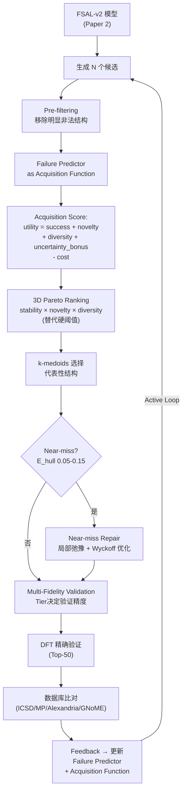

## GitHub/Codex 导出信息

- Repository name: `fiir-crystal`
- Repository role: Paper 3 指导文档
- Export path: `docs/guidance/04_paper3_discovery_pipeline.md`
- Document type: implementation guidance
- Main code module: `fiir_crystal.discovery`
- Related modules:
  - `fiir_crystal.failure`
  - `fiir_crystal.predictor`
  - `fiir_crystal.generation`
  - `fiir_crystal.evaluation`
- Main spec file to generate:
  - `docs/specs/discovery_pipeline.md`

---

## 工程实现边界

本页面用于指导 failure-informed discovery pipeline 实现。代码实现应拆成以下组件：

1. `fiir_crystal.discovery.pipeline`
   - 定义 discovery pipeline 主流程。
   - 支持 generate → screen → validate → rank → export → feedback 的闭环。
2. `fiir_crystal.discovery.screening`
   - 实现 Failure Predictor screening、MLIP screening、synthesizability screening 的接口。
   - 第一阶段不强制接入真实外部模型，只定义可替换接口。
3. `fiir_crystal.discovery.ranking`
   - 实现 Pareto ranking / multi-objective ranking。
   - 不建议只用 `f1 + f2 + f3` 或单一 `E_hull` 排序。
4. `fiir_crystal.discovery.validation`
   - 定义 MLIP validation、DFT validation、database novelty check 的接口。
   - 第一阶段只生成任务描述和占位结果，不运行真实 DFT。
5. `fiir_crystal.discovery.feedback`
   - 将 MLIP/DFT 失败结果回写到 failure buffer。
   - 支持后续更新 Failure Predictor 或 FSAL preference dataset。

---

## 实施目标

<aside>
🎯

构建**失败归因驱动的 Active Discovery Pipeline**——将 FSAL-v2 模型、Failure Predictor（升级为 critic + acquisition function）、3D Pareto ranking、可合成性评估与多保真 DFT 验证结合，**端到端发现 DFT 验证通过的全新可合成晶体**。FIIR-v2 核心升级：从静态筛选 pipeline 升级为 **Active Discovery Loop**，Failure Predictor 不再只做被动 reranking，而是主动决定"下一步探索哪里"。

</aside>

**目标 Venue**：npj Computational Materials / Nature Communications

**预估工期**：4–6 个月

**前置依赖**：Paper 1 的 Failure Predictor + Paper 2 的 FSAL 模型

---

## Step 1：确定目标应用场景

**推荐目标：宽带隙半导体**（band gap > 3.0 eV + 稳定 + 可合成）

**推荐化学空间**（按优先级排序）：

| 化学空间         | 元素体系                           | 典型目标            | 优势                               |
| ---------------- | ---------------------------------- | ------------------- | ---------------------------------- |
| **氧化物钙钛矿** | ABO₃（A=Ca/Sr/Ba, B=Ti/Zr/Sn/Hf）  | 高介电 / 铁电       | 结构规则、DFT 成本低、参考数据丰富 |
| **III-V 氮化物** | Al-Ga-In-N 及合金                  | UV LED / 功率器件   | 工业需求明确、PBE band gap 可校准  |
| **多元氧化物**   | Li/Na-TM-O（TM=过渡金属）三元/四元 | 固态电解质 / 宽带隙 | 与 MatterGen 差异化最大            |

**选择理由**：

- DFT band gap 计算成本相对低（PBE 弛豫 + HSE06 单点即可）
- 与 MatterGen (Zeni et al., _Nature_ 2025) [2]（磁性/力学）不重叠，差异化明显
- 功率电子学领域有明确工业需求
- 可用 MACE/CHGNet 快速预筛，再用 DFT 精确验证
- 选定一个具体子空间（如 ABO₃ 钙钛矿）可大幅缩小凸包计算范围，降低 DFT 成本

---

## Step 2：构建多保真分层筛选 Pipeline

### FIIR-v2 Active Discovery Loop 架构

<aside>
🔴

**FIIR-v2 核心升级**：从线性筛选 pipeline 升级为 **Active Discovery Loop**。关键变化：① Failure Predictor 升级为 **acquisition function**（不只判断好坏，还决定探索价值）；② 硬阈值筛选替换为 **3D Pareto ranking**（stability × novelty × diversity）；③ 增加 **near-miss repair** 模块（F3 near-miss 局部修复）；④ 多保真 budget 分配（不是所有候选都用同一精度验证）。

</aside>



### 各层实现

#### Layer 1：Failure Predictor as Acquisition Function（FIIR-v2 升级）

```python
import numpy as np
from sklearn_extra.cluster import KMedoids

def compute_acquisition_score(
    struct, failure_predictor,
    known_structures: list,
    composition_counts: dict
) -> dict:
    """
    FIIR-v2 Acquisition Function：不只判断好坏，还评估探索价值。
    utility(x) = predicted_success(x) + novelty(x)
                + diversity(x) + uncertainty_bonus(x) - cost(x)
    """
    pred = failure_predictor.predict(struct)

    # (a) predicted_success: 1 - 综合失败分数
    success_score = 1.0 - (pred["f1"] + pred["f2"] + pred["f3"]) / 3.0

    # (b) novelty: 与已知结构的最小距离
    from pymatgen.analysis.structure_matcher import StructureMatcher
    matcher = StructureMatcher(ltol=0.3, stol=0.5, angle_tol=10)
    min_dist = 1.0  # 默认完全新颖
    for known in known_structures[-1000:]:  # 只看最近的
        if matcher.fit(struct, known):
            min_dist = 0.0
            break
    novelty_score = min_dist

    # (c) diversity: 与已生成候选的组成多样性
    comp_key = struct.composition.reduced_formula
    comp_count = composition_counts.get(comp_key, 0)
    diversity_score = 1.0 / (1.0 + comp_count)

    # (d) uncertainty_bonus: Failure Predictor 不确定性
    uncertainty = pred.get("uncertainty", 0.0)
    uncertainty_bonus = 0.3 * uncertainty  # 鼓励探索不确定区域

    # (e) cost: 验证成本估计（原子数越多 DFT 越贵）
    cost_score = 0.1 * len(struct) / 100.0

    utility = (
        0.4 * success_score +
        0.2 * novelty_score +
        0.15 * diversity_score +
        0.15 * uncertainty_bonus -
        0.1 * cost_score
    )

    return {
        "utility": utility,
        "success_score": success_score,
        "novelty_score": novelty_score,
        "diversity_score": diversity_score,
        "uncertainty_bonus": uncertainty_bonus,
        "pred_f1": pred["f1"], "pred_f2": pred["f2"], "pred_f3": pred["f3"]
    }

def layer1_acquisition_ranking(
    candidates, failure_predictor,
    known_structures, composition_counts,
    top_k=5000
):
    """用 acquisition function 排序，选 top-k 候选"""
    scored = []
    for struct in candidates:
        acq = compute_acquisition_score(
            struct, failure_predictor,
            known_structures, composition_counts
        )
        scored.append((struct, acq))

    scored.sort(key=lambda x: x[1]["utility"], reverse=True)
    passed = scored[:top_k]

    print(f"Layer 1: {len(candidates)} → {len(passed)} "
          f"(top utility={passed[0][1]['utility']:.3f})")
    return passed
```

#### Layer 2：单 MLIP 弛豫 + $E_{\text{hull}}$（秒级）

```python
from mace.calculators import mace_mp
from ase.optimize import BFGS
from pymatgen.io.ase import AseAtomsAdaptor

def layer2_mlip_relaxation(
    candidates, ehull_threshold=0.1
):
    """MACE-MP-0 (Batatia et al., NeurIPS 2022) 弛豫 + E_hull 筛选 [8]"""
    calc = mace_mp(model="medium", device="cuda")
    passed = []

    for struct in candidates:
        atoms = AseAtomsAdaptor.get_atoms(struct)
        atoms.calc = calc
        opt = BFGS(atoms, logfile=None)
        opt.run(fmax=0.05, steps=200)

        e_per_atom = atoms.get_potential_energy() / len(atoms)
        e_hull = compute_ehull(struct, e_per_atom)  # 需凸包数据

        if e_hull < ehull_threshold:
            passed.append((struct, e_hull))

    print(f"Layer 2: {len(candidates)} → {len(passed)}")
    return passed
```

#### Layer 3：可合成性评估（CSLLM, Sun et al., _Nature Comm._ 2025 [17]）

```python
def layer3_synthesizability(
    candidates, csllm_model, threshold=0.5
):
    """
    CSLLM 可合成性分类器 (Sun et al., *Nature Communications* 2025) [17]
    GitHub: https://github.com/szl666/CSLLM

    输入：晶体结构的文本表示
    输出：可合成性概率 (0-1)
    """
    passed = []
    for struct, e_hull in candidates:
        # 将结构转为 CSLLM 输入格式
        text_repr = structure_to_csllm_format(struct)
        synth_score = csllm_model.predict(text_repr)

        if synth_score > threshold:
            passed.append((struct, e_hull, synth_score))

    print(f"Layer 3: {len(candidates)} → {len(passed)}")
    return passed
```

<aside>
💡

**安装 CSLLM [17]**：`git clone https://github.com/szl666/CSLLM.git`
TPR（真阳性率）约 98.8% 的可合成性预测（Sun et al., _Nature Communications_ 2025）。

</aside>

#### Layer 4：多 MLIP 交叉验证（Anti-Reward-Hacking）

```python
def layer4_multi_mlip_validation(
    candidates, ehull_threshold=0.1
):
    """
    三个独立 MLIP 交叉验证: MACE-MP-0 (Batatia et al., 2022) [8], CHGNet (Deng et al., 2023) [9], M3GNet (Chen & Ong, 2022) [10]
    只保留三者一致判定稳定的结构
    """
    from chgnet.model import CHGNet
    from chgnet.model.dynamics import CHGNetCalculator
    import matgl
    from matgl.ext.ase import M3GNetCalculator

    # 初始化三个计算器
    calc_mace = mace_mp(model="medium", device="cuda")
    chgnet = CHGNet.load()
    calc_chgnet = CHGNetCalculator(model=chgnet)
    pot = matgl.load_model("M3GNet-MP-2021.2.8-PES")
    calc_m3gnet = M3GNetCalculator(potential=pot)

    passed = []
    for struct, e_hull_mace, synth_score in candidates:
        atoms = AseAtomsAdaptor.get_atoms(struct)

        # CHGNet 弛豫
        atoms_chg = atoms.copy()
        atoms_chg.calc = calc_chgnet
        opt = BFGS(atoms_chg, logfile=None)
        opt.run(fmax=0.05, steps=200)
        e_hull_chgnet = compute_ehull(
            struct,
            atoms_chg.get_potential_energy() / len(atoms_chg)
        )

        # M3GNet 弛豫
        atoms_m3g = atoms.copy()
        atoms_m3g.calc = calc_m3gnet
        opt = BFGS(atoms_m3g, logfile=None)
        opt.run(fmax=0.05, steps=200)
        e_hull_m3gnet = compute_ehull(
            struct,
            atoms_m3g.get_potential_energy() / len(atoms_m3g)
        )

        # 要求 2/3 或 3/3 一致判定稳定
        stable_count = sum([
            e_hull_mace < ehull_threshold,
            e_hull_chgnet < ehull_threshold,
            e_hull_m3gnet < ehull_threshold
        ])

        if stable_count >= 2:  # 至少 2/3 一致
            passed.append({
                "structure": struct,
                "e_hull_mace": e_hull_mace,
                "e_hull_chgnet": e_hull_chgnet,
                "e_hull_m3gnet": e_hull_m3gnet,
                "synth_score": synth_score
            })

    print(f"Layer 4: {len(candidates)} → {len(passed)}")
    return passed
```

#### Layer 4.5（FIIR-v2 新增）：Near-miss Repair + 3D Pareto Ranking

```python
def pareto_ranking_3d(candidates, objectives=["stability", "novelty", "diversity"]):
    """
    3D Pareto Ranking（替代硬阈值筛选）。
    在 stability × novelty × diversity 三个目标上做 Pareto 排序。
    """
    n = len(candidates)
    # 提取 3 个目标值
    obj_matrix = np.array([
        [c["acq"]["success_score"], c["acq"]["novelty_score"],
         c["acq"]["diversity_score"]]
        for c in candidates
    ])

    # 计算 Pareto front layers
    pareto_layers = []
    remaining = set(range(n))

    while remaining:
        current_front = []
        for i in remaining:
            dominated = False
            for j in remaining:
                if i == j:
                    continue
                if all(obj_matrix[j] >= obj_matrix[i]) and any(obj_matrix[j] > obj_matrix[i]):
                    dominated = True
                    break
            if not dominated:
                current_front.append(i)

        pareto_layers.append(current_front)
        remaining -= set(current_front)

    # 返回按 Pareto layer 排序的候选
    ranked = []
    for layer_idx, layer in enumerate(pareto_layers):
        for idx in layer:
            candidates[idx]["pareto_layer"] = layer_idx
            ranked.append(candidates[idx])

    return ranked

def select_representative_structures(pareto_candidates, n_select=200):
    """
    k-medoids 聚类选择代表性结构（避免 Pareto front 上聚集过密的区域）。
    """
    features = np.array([
        [c["acq"]["success_score"], c["acq"]["novelty_score"],
         c["acq"]["diversity_score"]]
        for c in pareto_candidates[:min(1000, len(pareto_candidates))]
    ])

    kmedoids = KMedoids(n_clusters=min(n_select, len(features)), random_state=42)
    kmedoids.fit(features)
    selected_indices = kmedoids.medoid_indices_

    return [pareto_candidates[i] for i in selected_indices]

def near_miss_repair(candidates, ehull_range=(0.05, 0.15)):
    """
    Near-miss Repair（FIIR-v2 新增）：
    对 F3 near-miss 候选做局部结构优化，尝试"推"过稳定性阈值。
    仅做局部弛豫（不改变化学组成），限制为：
    - lattice strain relaxation
    - Wyckoff position refinement
    """
    repaired = []
    for cand in candidates:
        e_hull = cand.get("e_hull_mace", 1.0)
        if ehull_range[0] <= e_hull <= ehull_range[1]:
            struct = cand["structure"]

            # 局部弛豫：更严格的收敛条件
            from ase.optimize import BFGS
            from pymatgen.io.ase import AseAtomsAdaptor
            from mace.calculators import mace_mp

            atoms = AseAtomsAdaptor.get_atoms(struct)
            atoms.calc = mace_mp(model="large", device="cuda")  # 用更大模型
            opt = BFGS(atoms, logfile=None)
            opt.run(fmax=0.01, steps=500)  # 更严格收敛

            repaired_struct = AseAtomsAdaptor.get_structure(atoms)
            new_e_hull = compute_ehull(
                repaired_struct,
                atoms.get_potential_energy() / len(atoms)
            )

            if new_e_hull < e_hull:  # 确实改善了
                cand["structure_repaired"] = repaired_struct
                cand["e_hull_repaired"] = new_e_hull
                cand["repair_delta"] = e_hull - new_e_hull
                repaired.append(cand)

    print(f"Near-miss repair: {len(repaired)} structures improved")
    return repaired
```

#### Layer 5：DFT 精确验证

```python
def layer5_dft_validation(top_candidates, dft_code="vasp"):
    """
    对 Top-50 结构运行 DFT 完整弛豫

    推荐设置：
    - VASP 或 Quantum ESPRESSO
    - PBE 泛函
    - 完整 ionic + cell relaxation
    - Band gap 计算 (PBE 或 HSE06)
    """
    from pymatgen.io.vasp.sets import MPRelaxSet

    for i, cand in enumerate(top_candidates):
        struct = cand["structure"]

        # 生成 VASP 输入文件
        relax_set = MPRelaxSet(struct)
        relax_set.write_input(f"dft_runs/candidate_{i:03d}")

    print(f"已生成 {len(top_candidates)} 个 DFT 计算任务")
    print("请提交到 HPC 集群运行，预计 2-4 周")
```

---

## Step 3：运行 Active Discovery Loop（FIIR-v2 升级版）

```python
def run_active_discovery_loop(
    fsal_model,          # Paper 2 训练的 FSAL-v2 模型
    failure_predictor,   # Paper 1 训练的 Failure Predictor
    csllm_model,         # CSLLM 可合成性模型 [17]
    n_generate=50000,
    n_active_rounds=3    # Active Loop 轮数
):
    """FIIR-v2 Active Discovery Loop"""
    all_discoveries = []
    known_structures = []  # 已知结构池（用于 novelty 计算）
    composition_counts = {}  # 组成计数（用于 diversity 计算）

    for loop_round in range(n_active_rounds):
        print(f"\n=== Active Discovery Round {loop_round+1}/{n_active_rounds} ===")

        # 1. 生成 + Pre-filtering
        print("Step 1: 生成候选晶体...")
        candidates = fsal_model.generate(n_generate)
        candidates = [c for c in candidates
                      if pre_filter_trivially_invalid(c)[0]]
        print(f"  Pre-filter 后: {len(candidates)} 个候选")

        # 2. Acquisition Function 排序（替代硬阈值）
        print("Step 2: Acquisition function 排序...")
        scored = layer1_acquisition_ranking(
            candidates, failure_predictor,
            known_structures, composition_counts
        )

        # 3. MLIP 弛豫
        print("Step 3: MLIP 弛豫验证...")
        l2_passed = layer2_mlip_relaxation(
            [s for s, _ in scored[:5000]]
        )

        # 4. 可合成性
        print("Step 4: 可合成性评估...")
        l3_passed = layer3_synthesizability(l2_passed, csllm_model)

        # 5. 多 MLIP 交叉验证
        print("Step 5: 多 MLIP 交叉验证...")
        l4_passed = layer4_multi_mlip_validation(l3_passed)

        # 6. 3D Pareto Ranking + k-medoids 选择
        print("Step 6: Pareto ranking + representative selection...")
        for cand in l4_passed:
            cand["acq"] = compute_acquisition_score(
                cand["structure"], failure_predictor,
                known_structures, composition_counts
            )
        ranked = pareto_ranking_3d(l4_passed)
        representatives = select_representative_structures(ranked, n_select=100)

        # 7. Near-miss Repair
        print("Step 7: Near-miss repair...")
        repaired = near_miss_repair(representatives)

        # 8. 合并 + 选 Top-50 for DFT
        all_candidates = representatives + repaired
        top_50 = sorted(all_candidates,
                       key=lambda x: x.get("e_hull_repaired", x["e_hull_mace"]))[:50]

        # 9. DFT 验证
        print("Step 8: 准备 DFT 验证...")
        layer5_dft_validation(top_50)

        # 10. 数据库比对
        print("Step 9: 数据库新颖性比对...")
        check_novelty(top_50)

        # 11. Feedback: 更新已知结构池和 acquisition function
        for cand in top_50:
            known_structures.append(cand["structure"])
            comp = cand["structure"].composition.reduced_formula
            composition_counts[comp] = composition_counts.get(comp, 0) + 1

        all_discoveries.extend(top_50)
        print(f"  本轮发现 {len(top_50)} 个候选")

    print(f"\n总计发现 {len(all_discoveries)} 个候选")
    return all_discoveries
```

---

## Step 4：数据库新颖性比对

```python
from pymatgen.analysis.structure_matcher import StructureMatcher

def check_novelty(candidates, databases=["mp", "icsd", "alexandria"]):
    """
    比对四个数据库，确认结构的新颖性
    """
    matcher = StructureMatcher(
        ltol=0.2,   # 晶格容差
        stol=0.3,   # 位点容差
        angle_tol=5 # 角度容差
    )

    novel_count = 0
    for cand in candidates:
        is_novel = True
        for db_name in databases:
            db_structures = load_database(db_name)  # 自行实现
            for known_struct in db_structures:
                if matcher.fit(cand["structure"], known_struct):
                    is_novel = False
                    break
            if not is_novel:
                break

        cand["is_novel"] = is_novel
        if is_novel:
            novel_count += 1

    print(f"新颖结构: {novel_count}/{len(candidates)}")
    return candidates
```

---

## Step 5：关键实验清单

### Pipeline 端到端对比

| 方法                                                  | 生成量 | MLIP 通过 | 可合成 | DFT 验证 | 全新 |
| ----------------------------------------------------- | ------ | --------- | ------ | -------- | ---- |
| Baseline M₀ + MLIP 筛选                               | 50,000 | ?         | ?      | ?        | ?    |
| CrystalFormer-RL [1] + MLIP 筛选                      | 50,000 | ?         | ?      | ?        | ?    |
| PLaID++ [25] + MLIP 筛选                              | 50,000 | ?         | ?      | ?        | ?    |
| OMatG-IRL [26]（推理时 RL）+ MLIP 筛选                | 50,000 | ?         | ?      | ?        | ?    |
| Self-Correcting Search [28] 风格（推理时 probe 引导） | 50,000 | ?         | ?      | ?        | ?    |
| **FSAL + Repair + 多保真 Pipeline**                   | 50,000 | ?         | ?      | ?        | ?    |

### 其他关键实验

- [ ] **Reward Hacking 分析**：ML 稳定 vs DFT 稳定的一致率；多 MLIP 如何降低假阳性；参考 Nature Machine Intelligence 2025 的 MLIP 评估框架 [33]
- [ ] **可合成性闭环价值**："只筛稳定性" vs "稳定性 + 可合成性" 对比
- [ ] **Case Study**：Top-5 新发现结构详细展示（可视化 + DFT 电子结构 + 与已知材料对比）
- [ ] **数据泄漏审计**：对所有 DFT 通过结构，逐一与 Alexandria/MP/ICSD/GNoME 做 `StructureMatcher` 比对并报告去重结果
- [ ] **Reward Hacking 详细分析**：报告各 MLIP 的假阳性率和假阴性率（以 DFT 为 ground truth）
- [ ] **分层筛选效率**：各层的保留率和计算成本
- [ ] **FSAL vs 推理时方法端到端对比**：PLaID++ [25]、OMatG-IRL [26]、Self-Correcting Search [28] 风格的推理时引导各走一遍 pipeline，以 DFT 验证通过数和发现新颖结构数为最终评判
- [ ] **LeMat-GenBench 对齐**：所有方法在 LeMat-GenBench [18] leaderboard 上报告标准指标，确保与社区可比

---

## Step 6：DFT 结果分析

```python
def analyze_dft_results(dft_results, ml_predictions):
    """
    分析 DFT 结果，对比 ML 预测
    """
    concordance = []
    for res in dft_results:
        dft_ehull = res["dft_e_hull"]
        ml_ehull = ml_predictions[res["id"]]["e_hull_mace"]

        concordance.append({
            "id": res["id"],
            "dft_stable": dft_ehull < 0.1,
            "ml_stable": ml_ehull < 0.1,
            "dft_ehull": dft_ehull,
            "ml_ehull": ml_ehull,
            "error": abs(dft_ehull - ml_ehull),
            "band_gap": res.get("band_gap"),
        })

    # 统计
    ml_correct = sum(1 for c in concordance
                     if c["dft_stable"] == c["ml_stable"])
    print(f"ML-DFT 一致率: {ml_correct/len(concordance)*100:.1f}%")

    novel_stable = sum(1 for c in concordance if c["dft_stable"])
    print(f"DFT 验证通过: {novel_stable}/{len(concordance)}")

    return concordance
```

---

## 论文写作要点

### 标题

> _"From Failure to Discovery: Multi-Fidelity Crystal Generation with Failure-Structured Alignment"_

### 核心卖点

1. **Active Discovery Loop**：Failure Predictor 从被动 reranking 升级为主动 acquisition function——同时考虑 success probability + novelty + diversity + uncertainty（FIIR-v2 升级）
2. **3D Pareto Ranking + k-medoids**：用 Pareto 排序替代硬阈值，k-medoids 确保选出的代表性结构覆盖多样化区域（FIIR-v2 升级）
3. **Near-miss Repair**：对 F3 near-miss 做局部结构优化，"推"过稳定性阈值（FIIR-v2 升级）
4. **可合成性闭环**：CSLLM [17] 评估可合成性
5. **Anti-reward-hacking**：多 MLIP 交叉验证 [8][9][10]
6. **DFT 验证的新结构**：一个经 DFT 验证的新结构比 10 个指标表格都有说服力

<aside>
🏆

**期望成果**：发现 3–10 个 DFT 验证通过的全新稳定结构，其中 1–3 个同时通过可合成性评估。

</aside>

### 风险应对

- **DFT 通过率低** → 扩大生成量到 100,000 + near-miss repair 额外挽救；即使 1–2 个全新结构也有说服力
- **结构已存在于数据库** → 独立发现 = rediscovery = 方法有效性证据
- **F4 分类器不准** → 作为软筛选；报告有/无 F4 对比
- **Active Loop 计算成本高** → 多保真 budget 分配：Tier 4 只用 Failure Predictor，Tier 2-3 用单 MLIP，Tier 1 用 DFT——而非所有候选都走全流程

---

## 资源需求

| 资源               | 估计                               |
| ------------------ | ---------------------------------- |
| GPU（生成 + MLIP） | 2× A100，约 1 周                   |
| DFT 计算           | Top-50 完整 relaxation，约 2–4 周  |
| 可合成性评估       | CSLLM + Precursor LLM，约 1–2 天   |
| 数据库比对         | pymatgen StructureMatcher，约 1 天 |

---

## 参考文献（本页引用）

- [1] Cao & Wang, "CrystalFormer-RL: Reinforcement Fine-Tuning for Materials Design", arXiv:2504.02367, 2025. https://arxiv.org/abs/2504.02367
- [2] Zeni et al., "MatterGen: A generative model for inorganic materials design", _Nature_, 2025. https://www.nature.com/articles/s41586-025-08628-5
- [8] Batatia et al., "MACE: Higher Order Equivariant Message Passing Neural Networks", NeurIPS 2022; MACE-MP-0: arXiv:2401.00096. https://github.com/ACEsuit/mace
- [9] Deng et al., "CHGNet: Pretrained universal neural network potential", _Nature Machine Intelligence_, 2023. https://doi.org/10.1038/s42256-023-00716-3
- [10] Chen & Ong, "A universal graph deep learning interatomic potential (M3GNet)", _Nature Computational Science_, 2022. https://doi.org/10.1038/s43588-022-00349-3
- [17] Sun et al., "Accurate prediction of synthesizability and precursors via large language models (CSLLM)", _Nature Communications_, 2025. https://doi.org/10.1038/s41467-025-61778-y ; https://github.com/szl666/CSLLM
- [18] Betala et al., "LeMat-GenBench: A Unified Evaluation Framework for Crystal Generative Models", AI4Mat-NeurIPS 2025 Workshop. https://arxiv.org/abs/2512.04562
- [23] Ye et al., "Con-CDVAE + Active Learning for Crystal Inverse Design", arXiv:2502.16984, 2025. https://arxiv.org/abs/2502.16984
- [25] Xu et al., "PLaID++", ICML 2026. https://arxiv.org/abs/2509.07150
- [26] Höllmer & Martiniani, "OMatG-IRL", AI4Mat-ICLR 2026 Workshop. https://arxiv.org/abs/2602.00424
- [28] Goodfire, "Self-Correcting Search", 2026. https://www.goodfire.ai/research/self-correcting-search
- [33] "A framework to evaluate ML crystal stability predictions", _Nature Machine Intelligence_, 2025. https://www.nature.com/articles/s42256-025-01055-1

---

## 给 Codex 的实现指导

Codex 根据本页面实现代码时，第一阶段只搭建 discovery pipeline skeleton。

最小闭环：

1. 输入生成候选结构；
2. 调用 Failure Predictor 接口得到 failure score；
3. 调用 screening 接口筛选候选；
4. 调用 ranking 接口进行多目标排序；
5. 导出 Top-K 候选；
6. 生成 validation task metadata；
7. 将 validation result 回写成 feedback record。

不要在第一阶段实现真实 VASP、Quantum ESPRESSO、Materials Project API、CSLLM 或 MLIP 大模型调用。所有外部计算都先设计成 adapter interface。

Discovery pipeline 的目标不是单纯筛掉坏结构，而是在固定计算预算下提高 DFT-stable、novel、diverse candidate 的命中率。
