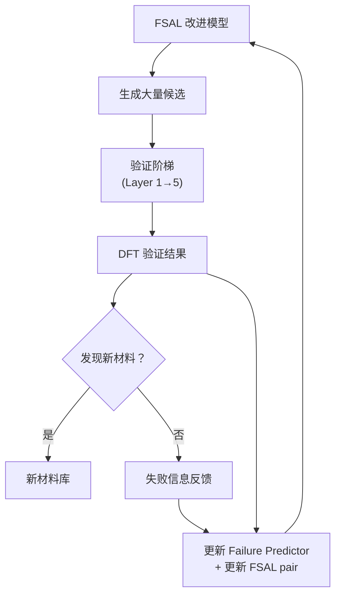

<aside>
🎯

**Paper 3 科学使命（v2.2 收敛版）**：验证失败感知生成模型在真实材料发现场景中的实用价值——在固定计算预算下，FIIR pipeline（含 constrained qEHVI 多目标选择 + conformal prediction UQ + 可合成性筛选）能否比现有方法发现更多经 DFT 验证的新材料？

</aside>

<aside>
🚦

**v2.2 执行约束**：
**① Paper 3 必须在 Paper 1/2 方法稳定后启动**，不与 Paper 1/2 同时推进为同等优先级。Paper 3 的需求不应反向增加 Paper 1/2 的负担。
**② 必须绑定具体材料场景**：不泛泛说"新材料发现"。推荐候选场景：固态电解质 / 锂电正极 / 热电材料 / 钙钛矿氧化物。选择标准：社区关注度高 + 有明确实验可验证性 + 有合理 baseline + Alexandria [13] 覆盖广。
**③ Repair/refiner 升级为 discovery pipeline 的第二阶段**：FSAL 改善生成分布 → Repair 修 near-miss → Validation ladder 筛最终候选。注意 repair 后结构必须用 DFT 做最终验证，避免 MLIP 弛豫的 circular validation。

</aside>

---

## 一、核心科学主张

### Discovery ≠ Reranking

Paper 3 要回答的不是"FSAL 能否生成更多稳定结构"（Paper 2 已回答），而是：

**失败感知生成模型 + Failure Predictor 能否构成一个有效的 active discovery pipeline，在真实材料发现中展现实用价值？**

具体而言：

1. Failure Predictor + constrained qEHVI 作为 acquisition function 是否比传统 energy-based screening 更有效？
2. 在固定计算预算（有限 DFT 计算次数）下，FIIR pipeline 是否命中更多新材料？
3. 发现的材料是否具有真正的 novelty（不在训练集/已知数据库中）且具备可合成性？
4. Conformal prediction UQ 是否比 ensemble disagreement 提供更可靠的不确定性估计？

---

## 二、方法论架构

### 从评估到发现：Failure Predictor 的角色转变

在 Paper 1 中，Failure Predictor 是一个评估器（evaluator）；在 Paper 3 中，它升级为 discovery 的核心组件：

| 角色         | Paper 1 中                                    | Paper 3 中                                     |
| ------------ | --------------------------------------------- | ---------------------------------------------- |
| **主要功能** | 预测 failure vector，替代昂贵的 MLIP ensemble | 作为 acquisition function 指导候选选择         |
| **输出用途** | 标注和诊断                                    | 多目标候选排序 + uncertainty-based exploration |
| **不确定性** | 标签质量指标                                  | exploration signal——高不确定性 = 值得探索      |

### 多目标候选选择原则

Discovery 不是单纯选"最稳定"的候选，而是在多个目标之间做 Pareto 最优选择：

**四个目标维度**：

1. **预测质量**：Failure Predictor 预测的 failure score 低（预期稳定）
2. **Novelty**：与训练集和已知数据库的距离远（真正新颖，F4 维度）
3. **可合成性**：CLscore / CSLLM 预测可合成（F5 维度）
4. **Exploration value**：Predictor 的不确定性高（信息增益大），使用 conformal prediction [42][44] 提供 distribution-free 覆盖率保证

**选择方法：Constrained qEHVI（升级版）**：

- 使用 **constrained q-Expected Hypervolume Improvement**（qEHVI）进行多目标 Pareto 最优选择
- 约束条件：F1 几何合法性 > 阈值 + F5 可合成性 > 阈值
- 优化目标：同时最大化稳定性、新颖性和探索价值
- 支持 **多保真 BO**（multi-fidelity Bayesian optimization）：MLIP 为低保真、single-point DFT 为中保真、full relax DFT 为高保真
- 代表性子集应在 failure vector 空间中分散，避免重复验证相似结构

---

## 三、验证阶梯（Validation Ladder）

发现的候选结构需要经过多层验证，逐步提高保真度：

| 阶段                                                                  | 方法角色                                                                                                                                                                                                                                                        | 淘汰标准                               | 关键升级                                                |
| --------------------------------------------------------------------- | --------------------------------------------------------------------------------------------------------------------------------------------------------------------------------------------------------------------------------------------------------------- | -------------------------------------- | ------------------------------------------------------- |
| **Layer 1: 规则过滤**                                                 | 移除明显非法结构                                                                                                                                                                                                                                                | F1 几何检测不通过                      | —                                                       |
| **Layer 2: Failure Predictor 快筛**                                   | 用 Predictor 快速估计五维 failure vector，初筛                                                                                                                                                                                                                  | 预测 failure score 过高                | 五维预测（含 F4/F5）                                    |
| **Layer 3: MLIP Ensemble 验证 + Chemistry-Aware Confidence Discount** | 对筛选后候选进行完整 MLIP ensemble 弛豫 + self-consistent hull 评估。**v2.2 新增**：应用 chemistry-aware confidence discount——MLIP ensemble disagreement 超过阈值的化学体系，F3 稳定性判定自动降低置信度（calibration tier 降一级），防止 MLIP 系统偏差导致误判 | $E_{\text{hull}}$ 过高或 MLIP 分歧过大 | Self-consistent hull + Conformal prediction UQ [42][44] |
| **Layer 4: Novelty + 可合成性检查**                                   | F4 泄漏检测（StructureMatcher 去重）+ F5 可合成性评估（CLscore [43] + CSLLM [17]）                                                                                                                                                                              | 已知结构或不可合成                     | CLscore 批量打分 + CSLLM 边界样本二次验证               |
| **Layer 5: DFT 验证**                                                 | 对最终候选进行高保真 DFT 计算                                                                                                                                                                                                                                   | DFT 验证不通过                         | 结果反馈至 Failure Predictor + Calibration Tier 更新    |

### 验证阶梯的方法论意义

- **计算效率**：每层淘汰大量候选，使昂贵的 DFT 只用于最有希望的结构
- **信息反馈**：DFT 结果反馈回 Failure Predictor 训练集，形成 active learning 闭环
- **成本可控**：固定 DFT 预算下最大化发现效率
- **Conformal prediction 保证**：Layer 3 的 MLIP 不确定性由 conformal prediction 提供 distribution-free 覆盖率保证（如 90% 的真实 E_hull 落在预测区间内），比 ensemble std 更可靠 [44]
- **Chemistry-aware confidence discount（v2.2）**：MLIP 对过渡金属氧化物、含 f 电子体系等化学空间存在系统偏差。Layer 3 利用 ensemble disagreement 自动识别高偏差体系并降低其 F3 标签的 calibration tier，使这些体系在 Pareto 选择中被适度保守对待，而非被 MLIP 假阳性误导

---

## 四、Active Discovery 闭环

### 闭环设计原则

**关键设计**：

1. **DFT 结果双向反馈**：
   - 成功的结构进入新材料库
   - 失败的结构（DFT 验证不通过）其失败信息反馈回 Failure Predictor 训练集
   - 所有 DFT 结果更新 Calibration Tier 边界
2. **Predictor 持续改进**：每轮 DFT 验证后，Predictor 在更准确的数据上重训
3. **FSAL 可选迭代**：若资源允许，DFT 反馈也可用于更新 FSAL 的 preference pair

---

## 五、应用场景选择原则

Paper 3 需要选择具体的材料发现场景来展示实用价值。选择原则：

### 场景要求

1. **社区关注度高**：目标材料体系应被材料科学社区广泛关注
2. **有明确的实验可验证性**：发现的材料有现实的合成/验证可能性
3. **有合理的 baseline 对比**：该场景已有其他生成模型的结果可以对比
4. **有足够的已知数据**：用于 novelty 检查和 leakage control

### 推荐场景方向（v2.1：必须选定一个具体场景）

- **固态电解质**（首选）：社区需求极大，锂离子传导体系数据丰富，Alexandria [13] 覆盖广，有明确的 DFT 验证标准（离子传导率、电化学稳定窗口）
- **锂电正极材料**：层状/尖晶石/橄榄石体系成熟，baseline 对比充分
- **热电材料**：结构多样性要求高，适合展示 FIIR 的多样性保持优势
- **钙钛矿氧化物**（ABX₃）：数据丰富，pair matching 天然按化学体系分组

**v2.1 执行要求**：在 Paper 1/2 完成后，基于以下标准选定唯一目标场景：① 数据可用性，② 计算预算可行性，③ DFT 验证标准明确性，④ 社区影响力。不允许泛泛地跑"全体系 discovery"。

---

## 六、Claim-Based 实验设计

| Claim                                         | 验证方法                                                                                    | 预期结论                                    |
| --------------------------------------------- | ------------------------------------------------------------------------------------------- | ------------------------------------------- |
| **FIIR pipeline 提升 discovery hit rate**     | 端到端对比：Baseline / CrystalFormer-RL [1] / PLaID++ [25] / OMatG-IRL [26] / FSAL pipeline | 固定 DFT 预算下 FSAL 命中率最高             |
| **Failure Predictor > energy-only screening** | 用 Failure Predictor 选候选 vs 仅用 $E_{\text{hull}}$ 排序选候选                            | 五维 failure 信息带来更高命中率             |
| **Constrained qEHVI > 简单 Pareto**           | Constrained qEHVI vs 简单 Pareto 排序 vs 纯 exploit vs 纯 explore                           | qEHVI 在多轮中累积发现最多且质量最优        |
| **Conformal UQ > ensemble disagreement**      | Conformal prediction [44] vs MLIP ensemble std 在 validation ladder 中的覆盖率与校准性      | Conformal prediction 提供更可靠的覆盖率保证 |
| **可合成性筛选提升实用性**                    | 有 F5 筛选（CLscore + CSLLM）vs 无 F5 筛选                                                  | F5 筛选后推荐结构的实验可合成率更高         |
| **验证阶梯节省计算**                          | 有 Layer 2（Predictor 快筛）vs 无 Layer 2                                                   | Predictor 快筛节省大量 MLIP 计算            |
| **Active learning 闭环有效**                  | 闭环（DFT 反馈更新 Predictor）vs 开环（不更新）                                             | 闭环在后续轮次持续改善                      |
| **发现的材料具有真正 novelty + 可合成性**     | 与 ICSD / Materials Project / GNoME / 训练集去重 + CLscore/CSLLM 验证                       | 发现的稳定结构不在已知数据库中且可合成      |

---

## 七、评价框架

### 核心指标

- **Discovery Hit Rate**：DFT 验证通过的新材料数 / 总 DFT 计算次数
- **Novelty Rate**：通过 DFT 验证且不在任何已知数据库中的比例（F4 验证）
- **Synthesizability Rate**：通过 DFT 验证且 CLscore/CSLLM 判定可合成的比例（F5 验证）
- **Cost Efficiency**：达到 N 个新材料发现所需的总计算量
- **Per-round Improvement**：闭环中每轮 DFT 后 hit rate 的改善
- **Material Diversity**：发现的新材料覆盖了多少化学体系 / 空间群
- **UQ Calibration**：Conformal prediction 区间的实际覆盖率 vs 名义覆盖率

### 对比方法

1. **Random Sampling + DFT**：随机生成 → 直接 DFT 验证
2. **Base Model + Energy Screening + DFT**：生成 → $E_{\text{hull}}$ 排序 → DFT
3. **CrystalFormer-RL [1] + Screening + DFT**
4. **PLaID++ [25] + Screening + DFT**
5. **OMatG-IRL [26] + Screening + DFT**
6. **FSAL + Failure Predictor + Validation Ladder + DFT**（我们的方法）

---

## 八、论文写作定位

### 目标 Venue

npj Computational Materials / Chemistry of Materials

### 核心卖点

1. **首个 failure-informed active crystal discovery pipeline**：不只是"生成更好的结构"，而是"在有限预算下发现更多新材料"
2. **Failure Predictor + constrained qEHVI**：将五维失败信息从"标签"升级为多目标优化的 acquisition function
3. **Conformal prediction UQ**：首次在晶体材料发现中使用 distribution-free 不确定性保证，替代启发式 ensemble disagreement
4. **可合成性感知的 validation ladder**：不只筛稳定性，还筛可合成性（CLscore + CSLLM），提升实验可实现率
5. **端到端闭环验证**：从生成到 DFT 验证的完整 pipeline，有真实的材料发现结果

### 关键叙事

> 现有的晶体生成方法关注"生成质量"——能否产生稳定的结构。但材料科学家真正关心的是"发现效率"和"实验可实现性"——在有限的计算和实验预算下，能否更快地找到真正可合成的新材料？Paper 3 证明，FIIR 的失败感知方法不仅提高生成质量，更通过五维失败感知 + 多目标优化 + 可合成性筛选，直接提升了材料发现的实用效率。

### 论文结构建议

1. Introduction：材料发现中的效率瓶颈 + 可合成性 gap
2. Method：FSAL 生成 → Constrained qEHVI 多目标选择 → 多层验证（含 Conformal UQ + 可合成性筛选）→ DFT 反馈闭环
3. Application Scenario：选定的目标材料体系
4. Results：Discovery hit rate + novelty + synthesizability + cost efficiency
5. Analysis：闭环中 Predictor 改善 + Conformal UQ 校准分析 + 发现材料的科学分析

### 参考文献

[1] CrystalFormer-RL, [3] MatterGen leakage, [4] OMatG, [13] Alexandria, [17] CSLLM, [18] LeMat-GenBench, [23] Con-CDVAE Active Learning, [25] PLaID++, [26] OMatG-IRL, [27] DAO, [33] MLIP eval framework, [34] MatInvent, [42] MLIP uncertainty calibration, [43] CLscore, [44] Conformal Prediction, [48] SyntheFormer
